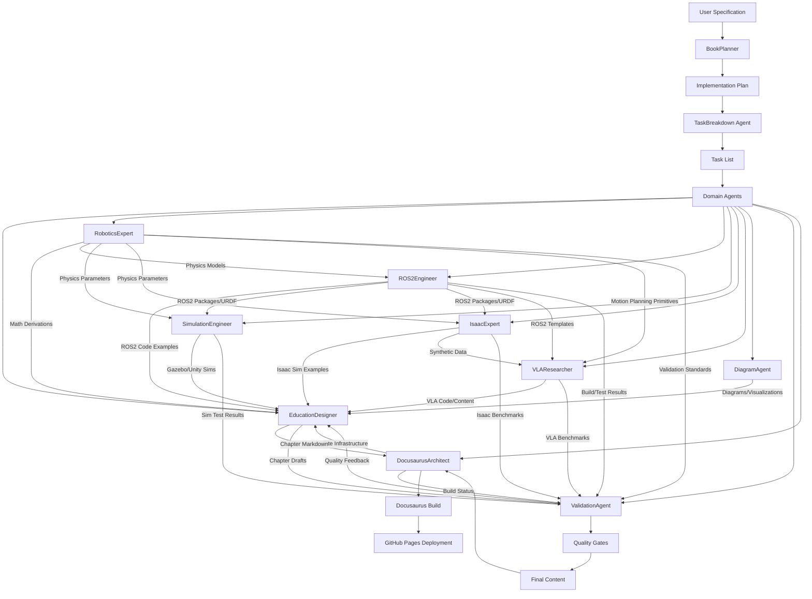

# Project Agents

This directory contains domain-focused agent definitions for the Physical AI & Humanoid Robotics Book project. Each agent is specialized for specific aspects of the book creation workflow.

## Agent Registry

### BookPlanner
**File**: `BookPlanner.md`
**Type**: Domain-Focused Planning Agent
**Status**: Active
**Created**: 2025-12-04

**Purpose**: Designs architecture and implementation strategy for educational book projects, translating feature specifications into actionable implementation plans.

**Key Responsibilities**:
- Book architecture design (chapter organization, dependencies)
- Technical planning (simulation integration, ROS 2 workspace)
- Content generation strategy (templates, workflows)
- Quality & validation gates (math, code, diagrams)
- Resource & dependency management

**Invocation**: Via `/sp.plan` command after specification creation

**Outputs**: Implementation plan (`plan.md`), chapter templates, workflow documentation

---

### RoboticsExpert
**File**: `RoboticsExpert.md`
**Type**: Domain-Focused Technical Validation & Content Generation Agent
**Status**: Active
**Created**: 2025-12-04

**Purpose**: Generates and validates robotics-specific technical content, ensuring all mathematical derivations, equations, and theoretical concepts meet professional standards and educational requirements.

**Key Responsibilities**:
- Mathematical content generation & validation (kinematics, dynamics, control)
- Equation derivation and cross-referencing against standard textbooks
- Technical accuracy enforcement (notation, units, dimensional consistency)
- Motion planning & trajectory generation mathematics
- Sensor fusion & perception algorithms
- Manipulation & grasping theory
- Humanoid-specific knowledge (ZMP, bipedal locomotion, whole-body control)

**Domain Expertise**:
- Reference textbooks: Craig, Spong, Murray/Li/Sastry, Siciliano, Featherstone, Lynch
- Robotics notation standards (DH parameters, SE(3), SO(3))
- Control theory (PID, MPC, optimal control, stability analysis)
- Kinematics (FK, IK, Jacobians, differential kinematics)
- Dynamics (Euler-Lagrange, Newton-Euler, inertia tensors)

**Invocation**: Called by ContentGeneration or ValidationAgent for technical content

**Outputs**: Validated mathematical derivations, equation blocks with references, numerical examples, validation metadata

---

### ROS2Engineer
**File**: `ROS2Engineer.md`
**Type**: Domain-Focused Implementation & Code Generation Agent
**Status**: Active
**Created**: 2025-12-04

**Purpose**: Generates and validates ROS 2 code, workspace structures, and robotics software architecture. Translates mathematical models from RoboticsExpert into executable ROS 2 implementations following official patterns and best practices.

**Key Responsibilities**:
- ROS 2 code generation (rclpy nodes, publishers, subscribers, services, actions)
- Workspace & package management (package.xml, CMakeLists.txt, setup.py)
- Middleware & communication patterns (topics, services, QoS profiles)
- Integration with simulation (Gazebo, Isaac Sim, Unity via ROS 2)
- Real-time & performance optimization (executors, callback groups)
- Testing & validation (pytest, launch_testing, code quality)
- URDF/Xacro robot description generation

**Domain Expertise**:
- ROS 2 Humble Hawksbill (LTS) on Ubuntu 22.04
- rclpy, ament_python/ament_cmake, colcon build system
- DDS middleware (Fast-DDS, Cyclone DDS), QoS configuration
- URDF/Xacro, robot_state_publisher, joint_state_publisher
- Nav2, ros2_control, TF2 system integration
- Gazebo Classic/Ignition, Isaac Sim, Unity Robotics Hub

**Invocation**: Called by ContentGeneration for code examples; collaborates with RoboticsExpert (math→code) and SimulationAgent

**Outputs**: ROS 2 packages with nodes, launch files, URDF, tests, documentation, metadata

---

### SimulationEngineer
**File**: `SimulationEngineer.md`
**Type**: Domain-Focused Simulation Environment & Integration Agent
**Status**: Active
**Created**: 2025-12-04

**Purpose**: Generates simulation environments, world files, physics configurations, and integrates ROS 2 packages into various simulators (Gazebo, Isaac Sim, Unity). Creates realistic digital twins for testing robotics algorithms.

**Key Responsibilities**:
- Gazebo/Ignition simulation (SDF worlds, plugins, physics configuration)
- NVIDIA Isaac Sim integration (USD scenes, PhysX, synthetic data, ROS 2 bridge)
- Unity Robotics Hub integration (scenes, ROS-TCP-Connector, C# scripts)
- Digital twin creation (synchronized with real systems, sensor noise models)
- Physics configuration (gravity, time step, friction, collision, damping)
- Sensor simulation (camera, lidar, IMU, force-torque with realistic noise)
- Integration & testing (ROS 2 packages from ROS2Engineer into simulators)

**Domain Expertise**:
- Gazebo Classic 11 / Ignition Fortress, SDF format, plugins (ModelPlugin, SensorPlugin)
- NVIDIA Isaac Sim 2023.1+, USD pipeline, PhysX, Replicator, ROS 2 bridge
- Unity 2022 LTS, Robotics Hub, Articulation Body, ROS-TCP-Connector, C# scripting
- Physics simulation (numerical integration, collision detection, contact resolution, friction models)
- Sensor models (camera intrinsics, lidar ray casting, IMU noise, force-torque)

**Invocation**: Called by ContentGeneration for simulation examples; receives ROS 2 packages from ROS2Engineer; receives physics parameters from RoboticsExpert

**Outputs**: Simulation worlds (SDF, USD, Unity scenes), launch files, physics configs, documentation, test scenarios

---

### IsaacExpert
**File**: `IsaacExpert.md`
**Type**: Domain-Focused NVIDIA Isaac Platform & GPU-Accelerated Simulation Agent
**Status**: Active
**Created**: 2025-12-04

**Purpose**: Specialized expert for NVIDIA Isaac ecosystem (Isaac Sim, Isaac ROS, Isaac Gym). Handles GPU-accelerated robotics simulation, photorealistic rendering, synthetic data generation, and advanced perception/navigation pipeline integration.

**Key Responsibilities**:
- Isaac Sim mastery (USD scenes, PhysX GPU physics, RTX rendering, Omniverse)
- Synthetic data generation (Replicator, domain randomization, labeled datasets)
- Isaac ROS integration (cuVSLAM, ESS, DOPE, AprilTag, DNN inference)
- ROS 2 bridge configuration (bidirectional communication, topic mapping, QoS)
- Isaac Gym RL (parallel environments, humanoid control, policy training)
- Perception & navigation pipelines (multi-sensor fusion, SLAM, object detection)
- GPU optimization & performance (PhysX GPU, TensorRT, multi-GPU)

**Domain Expertise**:
- Isaac Sim 2023.1+: Omniverse USD, PhysX 5, RTX rendering, Replicator, extensions
- Isaac ROS 2.0+: cuVSLAM, ESS, DOPE, FoundationPose, AprilTag, image processing
- Synthetic data: Domain randomization, semantic sensors, COCO/KITTI formats
- GPU computing: CUDA, TensorRT, cuDNN, PhysX GPU, NVIDIA Warp
- USD (Universal Scene Description): Stage/layers, prims, physics schemas, animation

**Invocation**: Called by ContentGeneration for Isaac Sim/ROS examples; receives ROS 2 packages from ROS2Engineer; provides synthetic data to VLAAgent

**Outputs**: Isaac Sim USD scenes, Replicator graphs, synthetic datasets, Isaac ROS launch files, RL policies, benchmarks

---

### VLAResearcher
**File**: `VLAResearcher.md`
**Type**: Domain-Focused Vision-Language-Action Research & Integration Agent
**Status**: Active
**Created**: 2025-12-04

**Purpose**: Specialized research and implementation agent for Vision-Language-Action (VLA) systems. Generates cutting-edge AI integration content covering voice-to-action pipelines, foundation models for robotics, multimodal perception, language-grounded control, and embodied intelligence for Chapters 12-13.

**Key Responsibilities**:
- Voice-to-action pipeline design (Whisper, LLM planning, ROS 2 integration)
- Vision-language model integration (CLIP, BLIP-2, GPT-4V, open-vocabulary detection)
- Vision-language-action systems (RT-1, RT-2, Octo, OpenVLA, PaLM-E)
- LLM-based task planning (GPT-4, Claude, Gemini, Code-as-Policies, SayCan)
- Embodied intelligence & foundation models (interactive learning, world models)
- Multimodal sensor fusion (RGB-D, point clouds, force-torque, proprioception)
- Conversational robotics & HRI (dialogue management, clarification strategies)

**Domain Expertise**:
- VLMs: CLIP, BLIP-2, LLaVA, GPT-4V, Gemini Vision, OWL-ViT, Grounding DINO, SAM
- VLA Models: RT-1, RT-2, RT-X, PaLM-E, Octo, OpenVLA, VIMA
- Speech: Whisper, Wav2Vec 2.0, Google/Azure Speech APIs, Coqui TTS
- LLMs: GPT-4, Claude, Gemini, LLaMA, Code-as-Policies, SayCan, ProgPrompt
- Embodied AI: Habitat, AI2-THOR, iGibson, BEHAVIOR, RoboSuite, MetaWorld
- Datasets: Open X-Embodiment, RoboNet, Bridge Data, Language-Table, CALVIN

**Invocation**: Called by ContentGeneration for Chapters 12-13; receives motion planning from RoboticsExpert; receives ROS 2 templates from ROS2Engineer; receives synthetic data from IsaacExpert

**Outputs**: VLA code examples, LLM integration nodes, VLM inference pipelines, voice-to-action systems, benchmarks, educational content

---

### EducationDesigner
**File**: `EducationDesigner.md`
**Type**: Domain-Focused Educational Content Architecture & Pedagogy Agent
**Status**: Active
**Created**: 2025-12-04

**Purpose**: Specialized educational design agent responsible for architecting pedagogically sound chapter structures, designing learning progressions, creating exercises and assessments, ensuring educational accessibility, and orchestrating content integration from all technical domain agents. Acts as the central "Content Generation Agent" transforming technical expertise into effective educational materials.

**Key Responsibilities**:
- Chapter structure design & pedagogical architecture (learning progressions, Bloom's taxonomy)
- Exercise & assessment design (conceptual, mathematical, coding challenges, quizzes)
- Educational accessibility & clarity (jargon management, analogies, glossary curation)
- Content integration & orchestration (coordinate all domain agents → synthesize into narrative)
- Writing & narrative development (technical writing, explanation sequencing, transitions)
- Docusaurus integration & formatting (MDX, cross-references, frontmatter, accessibility)
- Continuous improvement & iteration (feedback integration, content updates, error correction)

**Domain Expertise**:
- Instructional Design: ADDIE, Bloom's Taxonomy, Gagné's Nine Events, Cognitive Load Theory, Scaffolding
- Technical Writing: Plain language, active voice, conciseness, coherence, IEEE citation
- Assessment Design: Formative/summative, criterion-referenced, validity, reliability, rubrics
- Educational Technology: Docusaurus v3, Markdown/MDX, Mermaid, syntax highlighting, WCAG 2.1 AA
- Robotics Education: Simulation-first, theory-practice balance, incremental complexity, project-based learning

**Invocation**: Called by BookPlanner for chapter generation; coordinates with RoboticsExpert, ROS2Engineer, SimulationEngineer, IsaacExpert, VLAResearcher, DiagramAgent for content; iterates with ValidationAgent for quality gates

**Outputs**: Complete chapter markdown files (Overview → Quiz), exercises with solutions, quiz questions, glossary entries, Docusaurus-ready content

---

### DocusaurusArchitect
**File**: `DocusaurusArchitect.md`
**Type**: Domain-Focused Static Site Architecture & Build Engineering Agent
**Status**: Active
**Created**: 2025-12-04

**Purpose**: Specialized Docusaurus v3 architecture and build engineering agent responsible for static site infrastructure, configuration management, theme customization, plugin integration, build optimization, deployment pipelines, and technical infrastructure. Ensures educational content is delivered through a fast, accessible, maintainable web platform deployed to GitHub Pages.

**Key Responsibilities**:
- Docusaurus project architecture & configuration (site config, directory structure, sidebar, navbar, footer, versioning)
- Theme customization & design system (color palette, typography, logos, dark mode, responsive design, WCAG 2.1 AA)
- Plugin integration & extensions (search, SEO, analytics, Mermaid, KaTeX, image optimization, PWA)
- Build optimization & performance (bundle size, lazy loading, caching, Lighthouse ≥90)
- Deployment pipeline & CI/CD (GitHub Actions, GitHub Pages, preview deployments, rollback)
- Custom React components & MDX (LearningObjectives, ExerciseBlock, QuizQuestion, CodeSandbox, video embeds)
- Maintenance & monitoring (dependency updates, broken links, analytics, accessibility audits, error tracking)

**Domain Expertise**:
- Docusaurus v3: Configuration, presets, plugins, themes, versioning, i18n, CLI
- Static Site Generation: React, JSX, Markdown, MDX, Webpack, SSR, client-side hydration
- Web Performance: Critical rendering path, code splitting, minification, compression, caching, lazy loading
- GitHub Pages: Deployment, custom domain, HTTPS, limitations (1GB, static only)
- Accessibility: WCAG 2.1 AA, semantic HTML, alt text, keyboard navigation, ARIA, screen readers
- SEO: Meta tags, Open Graph, Twitter Cards, structured data, sitemap, robots.txt
- CI/CD: GitHub Actions, build validation, deployment triggers, matrix builds, notifications

**Invocation**: Called by BookPlanner for initial site setup; provides infrastructure for EducationDesigner content; monitors deployments for ValidationAgent

**Outputs**: Docusaurus configuration files, custom React components, GitHub Actions workflows, deployment metadata, Lighthouse performance reports

---

## Agent Ecosystem Architecture

## Agent Interaction Patterns

### Planning Phase
1. **SpecificationAgent** creates `spec.md` from user requirements
2. **BookPlanner** reads spec and creates `plan.md` with architecture
3. **ADR Agent** documents architectural decisions
4. **TaskBreakdown Agent** generates `tasks.md` from plan

### Implementation Phase
1. **ContentGeneration Agents** produce chapter content following templates
2. **Domain Agents** (Kinematics, Control, Perception) provide specialized content
3. **ValidationAgent** enforces quality gates (math, code, diagrams)
4. **PHR Agent** documents all generation sessions

### Integration Phase
1. **Build Agent** compiles Docusaurus site
2. **Deployment Agent** publishes to GitHub Pages
3. **ValidationAgent** performs final quality checks

## Agent Design Principles

All agents in this project must comply with the constitution (`.specify/memory/constitution.md`) and follow these principles:

### 1. Domain-Focused
- Each agent has clear, bounded domain of expertise
- Agents do not overlap in responsibilities
- Agents delegate outside their domain

### 2. SDD Compliance
- All agents follow Spec-Driven Development workflow
- Planning precedes generation (no content without approved spec)
- All decisions documented in PHRs and ADRs

### 3. Constitution Alignment
- Agents enforce constitution principles I-VII
- Quality gates mandatory (Principle VII)
- Consistency mechanisms built-in (Principle IV)
- Technical accuracy validated (Principle I)

### 4. Human-in-the-Loop
- Agents request clarification for ambiguous requirements
- Significant decisions require user approval
- Agents surface options rather than making arbitrary choices

### 5. Traceable & Auditable
- All agent actions documented in PHRs
- Architectural decisions captured in ADRs
- Clear lineage from spec → plan → tasks → implementation

## Planned Agents (Roadmap)

### ValidationAgent
**Status**: Planned
**Purpose**: Enforce quality gates and validate content
**Domain**: Math validation, code testing, diagram review, consistency checks
**Note**: Uses RoboticsExpert validation standards for mathematical content

### DiagramAgent
**Status**: Planned
**Purpose**: Generate technical diagrams and visualizations
**Domain**: Mermaid diagrams, kinematic chain visualizations, control block diagrams
**Note**: Visualizes mathematical concepts from RoboticsExpert

## Adding New Agents

To add a new agent to the project:

1. **Define Agent Scope**
   - Identify clear domain of expertise
   - Define responsibilities and boundaries
   - Ensure no overlap with existing agents

2. **Create Agent Definition**
   - Copy structure from `BookPlanner.md`
   - Document purpose, responsibilities, constraints
   - Define inputs, outputs, and interaction patterns
   - Verify constitution compliance

3. **Update Agent Registry**
   - Add entry to this README
   - Document in ecosystem architecture diagram
   - Define interaction patterns with other agents

4. **Create PHR**
   - Document agent creation session
   - Capture rationale and design decisions

5. **Test Agent Integration**
   - Verify agent invocation patterns work
   - Validate outputs meet requirements
   - Confirm handoffs to downstream agents

## Agent Command Reference

| Command | Agent | Purpose |
|---------|-------|---------|
| `/sp.constitution` | Constitution Agent | Create/update project constitution |
| `/sp.specify` | Specification Agent | Create feature specification |
| `/sp.plan` | **BookPlanner** | Create implementation plan |
| `/sp.tasks` | TaskBreakdown Agent | Generate task list from plan |
| `/sp.implement` | Implementation Agent | Execute tasks and generate content |
| `/sp.adr` | ADR Agent | Document architectural decision |
| `/sp.phr` | PHR Agent | Create prompt history record |
| `/sp.clarify` | Clarification Agent | Identify underspecified areas |
| `/sp.analyze` | Analysis Agent | Perform consistency analysis |

## Governance

- **Agent Authority**: Constitution supersedes all agent behaviors
- **Agent Amendments**: New agents require ADR documenting rationale
- **Agent Deprecation**: Agents can be deprecated with migration plan
- **Agent Versioning**: Agents track version and last-updated date
- **Agent Ownership**: Each agent has designated project owner

## Resources

- **Constitution**: `.specify/memory/constitution.md`
- **Templates**: `.specify/templates/`
- **Planning Artifacts**: `specs/{feature-name}/`
- **History**: `history/prompts/`, `history/adr/`

---

**Registry Version**: 1.0.0
**Last Updated**: 2025-12-04
**Maintainer**: Physical AI & Humanoid Robotics Book Project
