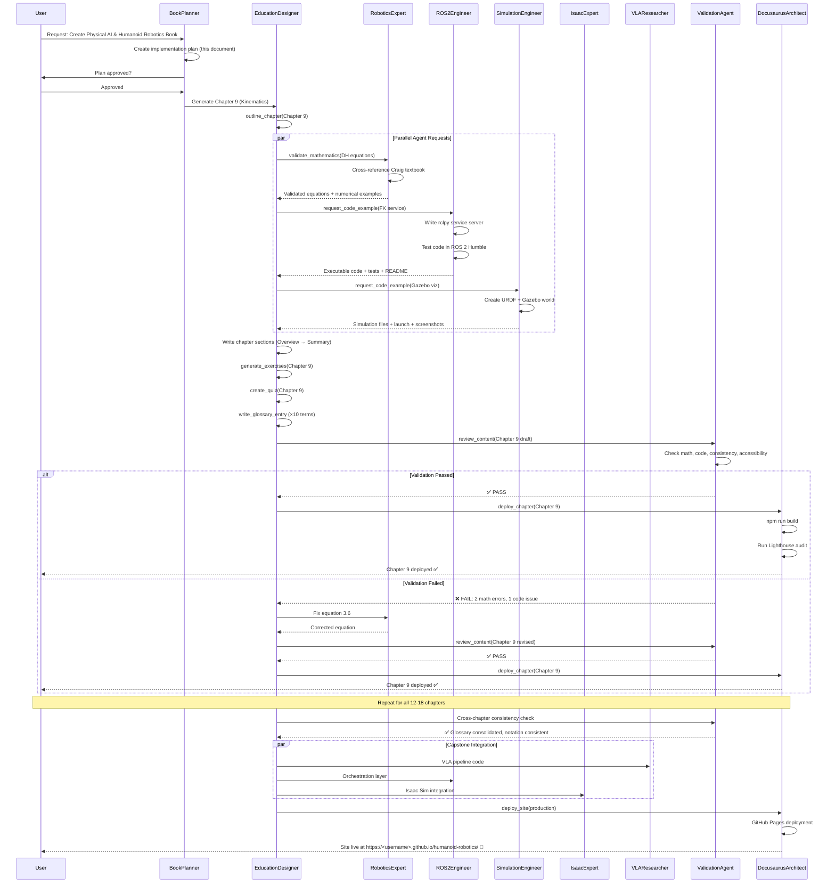

# Implementation Plan: Physical AI & Humanoid Robotics Course System

**Branch**: `002-physical-ai-humanoid-robotics-book` | **Date**: 2025-12-04 | **Spec**: [spec.md](./spec.md)
**Input**: Feature specification from `/specs/002-physical-ai-humanoid-robotics-book/spec.md`

## Summary

This plan outlines the development of a comprehensive Docusaurus-based textbook covering Physical AI, Humanoid Robotics, embodied intelligence, ROS 2, and Vision-Language-Action systems. The system uses a spec-driven writing workflow with multi-agent collaboration, where specialized domain agents (RoboticsExpert, ROS2Engineer, SimulationEngineer, IsaacExpert, VLAResearcher) provide technical content to EducationDesigner, who synthesizes it into pedagogically sound chapters deployed via DocusaurusArchitect to GitHub Pages.

**Technical Approach**: Multi-agent orchestration with 8 specialized agents executing 10 reusable skills across 5 development phases to generate 12-18 chapters (~30,000 words) with validated mathematics, executable code, simulation examples, and AI integration.

## Technical Context

**Language/Version**: Python 3.10+, JavaScript/Node.js 18+ (Docusaurus), ROS 2 Humble (Ubuntu 22.04 LTS)
**Primary Dependencies**: Docusaurus v3.0+, rclpy, Gazebo Classic/Ignition Fortress, Unity 2022 LTS, NVIDIA Isaac Sim 2023.1+, Context7 MCP
**Storage**: Markdown in `/docs/`, code in GitHub repo (`/examples/`), large assets in external CDN, PHRs in `history/prompts/`, ADRs in `history/adr/`
**Testing**: Manual validation (math against textbooks, diagrams), automated (code execution via pytest/colcon, Docusaurus build via `npm run build`)
**Target Platform**: Web (GitHub Pages), Development (Ubuntu 22.04 native/VM/WSL/Docker)
**Project Type**: Documentation/Educational Content (Static Site Generator)
**Performance Goals**: Site loads <3s (Lighthouse ≥90), code examples run on mid-range GPU (GTX 1660 Ti / RTX 3060), simulation examples run at ≥30 FPS
**Constraints**:
- GitHub Pages 1GB site size limit → Optimize assets, use external CDN
- ROS 2 Humble support until May 2027 → Pin all versions explicitly
- Free/open-source tools preferred → Document paid API alternatives
- Mathematical accuracy non-negotiable → Validate all equations against standard textbooks
**Scale/Scope**:
- 12-18 chapters × ~2,000 words = ~30,000 words total
- 50-100 executable code examples (Python, ROS 2, URDF, C#)
- 30-50 diagrams (Mermaid, images)
- 100+ glossary terms
- 200+ exercise problems with solutions
- 150+ quiz questions

## Constitution Check

*GATE: Must pass before Phase 0 research. Re-check after Phase 1 design.*

### Constitution Compliance Review

✅ **Principle I: Technical Accuracy & Scientific Rigor**
- All mathematics validated against Craig, Spong, Murray/Li/Sastry textbooks (validate_mathematics skill)
- Code examples tested in target environments (ROS2Engineer, SimulationEngineer agents)
- Zero tolerance for technical errors (ValidationAgent review_content skill)

✅ **Principle II: Educational Accessibility & Structured Learning**
- Consistent pedagogical structure enforced (outline_chapter skill)
- Bloom's taxonomy coverage in exercises (generate_exercises, create_quiz skills)
- Progressive difficulty from intuition to formalism (EducationDesigner agent)

✅ **Principle III: Modularity & Scalability**
- Docusaurus v3 modular structure (`/docs/{chapter}/index.md`)
- Self-contained chapters with clear dependencies (outline_chapter skill)
- Reusable components via MDX (DocusaurusArchitect agent)

✅ **Principle IV: Consistency Across Chapters**
- Standardized terminology via glossary (write_glossary_entry skill)
- Consistent mathematical notation (RoboticsExpert validation standards)
- Uniform formatting (ValidationAgent review_content skill)

✅ **Principle V: AI-Native Authoring Workflow**
- Spec-Driven Development with SpecKit-Plus + Claude Code
- Multi-agent collaboration (8 domain-focused agents)
- PHR documentation for all generation sessions (sp.phr command)
- Human-in-the-loop for architectural decisions

✅ **Principle VI: Code & Simulation Standards**
- Python PEP 8, ROS 2 style guide compliance (ROS2Engineer agent)
- All code syntactically correct and executable (request_code_example skill)
- Simulation setup instructions with dependencies (SimulationEngineer agent)

✅ **Principle VII: Quality Gates & Validation (NON-NEGOTIABLE)**
- Mathematics validation gate (validate_mathematics skill)
- Code testing gate (pytest, colcon build)
- Build validation gate (Docusaurus compile, Lighthouse scores)
- Consistency validation gate (review_content skill)

**Gate Status**: ✅ ALL GATES PASSED - Proceed to Phase 0 Research

## Project Structure

### Documentation (this feature)

```text
specs/002-physical-ai-humanoid-robotics-book/
├── spec.md              # Feature specification (COMPLETE)
├── plan.md              # This file (Implementation plan - IN PROGRESS)
├── research.md          # Phase 0 output - Technical research findings
├── data-model.md        # Phase 1 output - Chapter entities and metadata schema
├── quickstart.md        # Phase 1 output - Quick start guide for contributors
├── contracts/           # Phase 1 output - Agent interaction contracts
│   ├── agent-coordination.md       # Agent handoff specifications
│   ├── skill-invocation.md         # Skill input/output contracts
│   └── validation-gates.md         # Quality gate criteria
└── tasks.md             # Phase 2 output (/sp.tasks command - NOT created by /sp.plan)
```

### Source Code (repository root)

```text
# Option 2: Web application (Docusaurus frontend + ROS 2 backend examples)

docs/                           # Docusaurus content (generated by agents)
├── 01-introduction-physical-ai/
│   ├── index.md               # Chapter content (EducationDesigner output)
│   ├── assets/                # Diagrams, images, videos
│   └── exercises.md           # Practice problems
├── 02-sensors-perception/
├── 03-ros2-fundamentals/
├── 04-embodied-intelligence/
├── 05-gazebo-simulation/
├── 06-unity-robotics/
├── 07-isaac-sim/
├── 08-urdf-robot-models/
├── 09-kinematics/
├── 10-bipedal-locomotion/
├── 11-manipulation-grasping/
├── 12-voice-to-action/
├── 13-vision-language-action/
├── 14-capstone-project/
├── 15-hardware-infrastructure/
└── glossary.md                # Centralized glossary (write_glossary_entry outputs)

examples/                       # Executable code examples (agent outputs)
├── ros2_workspace/            # ROS 2 packages (ROS2Engineer output)
│   ├── src/
│   │   ├── fk_service/        # Forward kinematics service
│   │   ├── sensor_processing/ # Sensor data processing nodes
│   │   ├── vla_pipeline/      # VLA system integration
│   │   └── ...
│   ├── package.xml
│   └── CMakeLists.txt
├── simulation/                # Simulation worlds (SimulationEngineer output)
│   ├── gazebo/
│   │   ├── worlds/            # SDF world files
│   │   ├── models/            # URDF robot models
│   │   └── launch/            # Launch files
│   ├── isaac_sim/             # Isaac Sim USD scenes (IsaacExpert output)
│   │   ├── scenes/
│   │   ├── scripts/
│   │   └── replicator/        # Synthetic data generation
│   └── unity/                 # Unity scenes (SimulationEngineer output)
│       ├── Scenes/
│       └── Scripts/
├── vla_systems/               # VLA code examples (VLAResearcher output)
│   ├── voice_to_action/       # Whisper + LLM planning
│   ├── vision_language/       # CLIP, BLIP-2 integration
│   └── llm_planning/          # GPT-4 task decomposition
└── requirements.txt           # Python dependencies

static/                        # Static assets (DocusaurusArchitect manages)
├── img/                       # Logo, favicon
├── diagrams/                  # Pre-generated diagram images
└── videos/                    # Educational videos (external CDN links)

src/                           # Docusaurus customizations (DocusaurusArchitect)
├── components/                # Custom React components
│   ├── LearningObjectives.tsx
│   ├── ExerciseBlock.tsx
│   ├── QuizQuestion.tsx
│   └── CodeSandbox.tsx
├── css/
│   └── custom.css             # Theme customization
└── pages/                     # Custom pages (index, about)

.specify/                      # SpecKit-Plus infrastructure (existing)
├── agents/                    # Agent definitions (8 agents)
│   ├── BookPlanner.md
│   ├── RoboticsExpert.md
│   ├── ROS2Engineer.md
│   ├── SimulationEngineer.md
│   ├── IsaacExpert.md
│   ├── VLAResearcher.md
│   ├── EducationDesigner.md
│   └── DocusaurusArchitect.md
├── skills/                    # Reusable skills (10 skills)
│   ├── outline_chapter/
│   ├── validate_mathematics/
│   ├── generate_exercises/
│   ├── create_quiz/
│   ├── write_glossary_entry/
│   ├── design_diagram/
│   ├── request_code_example/
│   ├── coordinate_agents/
│   ├── review_content/
│   └── deploy_chapter/
├── templates/                 # Templates (existing)
│   ├── spec-template.md
│   ├── plan-template.md
│   ├── tasks-template.md
│   ├── adr-template.md
│   └── phr-template.prompt.md
└── memory/
    └── constitution.md        # Project constitution v1.0.0

history/                       # Audit trail
├── prompts/                   # Prompt History Records
│   ├── constitution/
│   ├── physical-ai-humanoid-robotics-book/  # Feature-specific PHRs
│   └── general/
└── adr/                       # Architecture Decision Records
    └── 001-multi-agent-architecture.md

docusaurus.config.js           # Docusaurus configuration (DocusaurusArchitect)
package.json                   # Node.js dependencies
sidebars.js                    # Sidebar navigation structure
.github/
└── workflows/
    ├── build-deploy.yml       # GitHub Pages deployment pipeline
    └── validate-code.yml      # Code example testing CI
```

**Structure Decision**: Selected **Option 2 (Web application)** because:
1. **Frontend**: Docusaurus static site for educational content (docs/, src/)
2. **Backend**: ROS 2 workspace with executable examples (examples/ros2_workspace/)
3. **Separation of Concerns**: Content generation (agents → docs/) vs. infrastructure (DocusaurusArchitect → src/, config)
4. **Scalability**: Modular structure allows independent development of chapters and code examples
5. **Multi-agent Compatibility**: Clear ownership boundaries (EducationDesigner → docs/, ROS2Engineer → examples/, DocusaurusArchitect → src/)

## Complexity Tracking

> **Fill ONLY if Constitution Check has violations that must be justified**

*No violations detected. All complexity is justified and aligned with constitution principles.*

---

# PHASE 0: Research & Discovery

**Duration**: 1-2 days
**Objective**: Validate technical feasibility, research robotics textbooks, confirm tooling integration
**Outputs**: `research.md` with findings

## Research Tasks

### 0.1 Robotics Textbook Validation
**Owner**: RoboticsExpert
**Input**: Constitution Principle I requirements
**Output**: Validated reference textbooks with notation mappings

**Tasks**:
1. Confirm access to standard robotics textbooks:
   - Craig, J.J. "Introduction to Robotics: Mechanics and Control" (DH parameters, FK/IK)
   - Spong, M.W., Hutchinson, S., Vidyasagar, M. "Robot Modeling and Control" (Dynamics, control)
   - Murray, R.M., Li, Z., Sastry, S.S. "A Mathematical Introduction to Robotic Manipulation" (Geometric mechanics)
   - Lynch, K.M., Park, F.C. "Modern Robotics" (SE(3)/SO(3) notation)
2. Create notation mapping table (DH parameters: θ, d, a, α; Transforms: T ∈ SE(3); Joint variables: q, q̇, q̈)
3. Identify equations for each chapter (Chapter 9 Kinematics: DH transforms, FK, Jacobian; Chapter 10 Locomotion: ZMP, gait planning)
4. Document validation methodology (equation-by-textbook cross-reference protocol)

**Success Criteria**: Notation standard selected (Craig convention), reference equations identified for all 12-18 chapters

---

### 0.2 ROS 2 Environment Validation
**Owner**: ROS2Engineer
**Input**: Technical Context (ROS 2 Humble, Ubuntu 22.04)
**Output**: Validated ROS 2 setup and code templates

**Tasks**:
1. Confirm ROS 2 Humble installation on Ubuntu 22.04 (or Docker alternative)
2. Test basic rclpy node creation, publisher/subscriber, service/action patterns
3. Validate URDF/Xacro parsing with robot_state_publisher
4. Test colcon build system with sample package
5. Create code example templates:
   - `template_node.py` (rclpy node boilerplate)
   - `template_service.py` (service server/client)
   - `template_action.py` (action server/client)
   - `template_launch.py` (launch file)
   - `template_package.xml` (package dependencies)

**Success Criteria**: ROS 2 Humble environment functional, code templates tested and executable

---

### 0.3 Simulation Tools Validation
**Owner**: SimulationEngineer + IsaacExpert
**Input**: Technical Context (Gazebo, Unity, Isaac Sim)
**Output**: Validated simulation environments and integration tests

**Tasks**:
1. **Gazebo Classic/Ignition**:
   - Install Gazebo Classic 11 or Ignition Fortress
   - Test URDF spawning with `ros2 run gazebo_ros spawn_entity.py`
   - Validate physics plugin integration (ModelPlugin, SensorPlugin)
2. **Unity Robotics Hub**:
   - Install Unity 2022 LTS with Robotics Hub package
   - Test ROS-TCP-Connector communication with ROS 2
   - Validate Articulation Body physics simulation
3. **NVIDIA Isaac Sim**:
   - Install Isaac Sim 2023.1+ (or confirm cloud access)
   - Test USD scene creation and PhysX GPU physics
   - Validate ROS 2 bridge (Isaac ROS messages)
   - Test Replicator synthetic data generation
4. Create integration test scenarios:
   - Spawn simple robot in each simulator
   - Control via ROS 2 topics
   - Capture sensor data (camera, lidar)

**Success Criteria**: All 3 simulators functional, ROS 2 integration tested, synthetic data pipeline validated

---

### 0.4 Context7 MCP Integration Research
**Owner**: DocusaurusArchitect
**Input**: Spec FR-019 (Context7 MCP support)
**Output**: MCP integration guide and workflow documentation

**Tasks**:
1. Research Context7 MCP capabilities for Docusaurus operations
2. Test file creation/editing via MCP (create sample chapter markdown)
3. Validate Docusaurus build triggers via MCP
4. Document MCP command patterns for agents:
   - Create chapter file: `mcp.create_file(path, content)`
   - Update navigation: `mcp.edit_config(docusaurus.config.js)`
   - Build site: `mcp.run_command("npm run build")`
5. Identify limitations and fallback approaches (manual file operations if MCP unavailable)

**Success Criteria**: Context7 MCP functional for file operations, Docusaurus build workflow documented

---

### 0.5 VLA System Architecture Research
**Owner**: VLAResearcher
**Input**: Spec Chapters 12-13 requirements
**Output**: VLA pipeline architecture and API integration guide

**Tasks**:
1. Research state-of-the-art VLA systems:
   - Vision-Language Models: CLIP, BLIP-2, LLaVA, GPT-4V, Gemini Vision
   - VLA Models: RT-1, RT-2, Octo, OpenVLA, PaLM-E
   - Speech-to-Text: Whisper (local), Google/Azure Speech API
   - LLM Planning: GPT-4, Claude, Gemini, Code-as-Policies, SayCan
2. Define voice-to-action pipeline architecture:
   - Speech Recognition → Transcript → LLM Task Planning → Motion Primitives → ROS 2 Actions
3. Define VLA system architecture:
   - RGB-D Camera → Vision Encoder (CLIP) → Language Grounding → Action Decoder → Robot Commands
4. Document API requirements:
   - OpenAI API (GPT-4, Whisper)
   - Anthropic API (Claude)
   - Open-source alternatives (Whisper local, LLaMA, CLIP local)
5. Estimate costs for learners (API usage for examples)
6. Identify failure modes and mitigation strategies (recognition errors, invalid plans, safety constraints)

**Success Criteria**: VLA pipeline architectures defined, API integration documented, cost estimates provided, failure modes identified

---

### 0.6 Performance & Accessibility Benchmarking
**Owner**: DocusaurusArchitect
**Input**: Performance Goals (site <3s load, Lighthouse ≥90)
**Output**: Performance baseline and optimization strategies

**Tasks**:
1. Create minimal Docusaurus site with sample chapter
2. Run Lighthouse audit (Performance, Accessibility, SEO, Best Practices)
3. Measure baseline metrics:
   - Load time (target: <3s)
   - Bundle size (target: <500KB gzipped)
   - Time to Interactive (target: <3s)
   - Accessibility score (target: 100)
4. Test with large assets (diagrams, code blocks, videos)
5. Identify optimization strategies:
   - Image optimization (WebP, lazy loading)
   - Code splitting (dynamic imports)
   - Asset CDN (external hosting for videos)
   - Caching (service worker, browser cache)
6. Document accessibility best practices:
   - Alt text for all images
   - Semantic HTML (headings, landmarks)
   - Keyboard navigation
   - Screen reader compatibility

**Success Criteria**: Baseline Lighthouse scores measured, optimization strategies identified, accessibility checklist created

---

## Research Deliverables Summary

**File**: `specs/002-physical-ai-humanoid-robotics-book/research.md`

**Contents**:
1. Robotics textbook notation mapping (RoboticsExpert)
2. ROS 2 environment setup guide (ROS2Engineer)
3. Simulation integration test results (SimulationEngineer + IsaacExpert)
4. Context7 MCP workflow documentation (DocusaurusArchitect)
5. VLA system architecture diagrams (VLAResearcher)
6. Performance baseline and optimization plan (DocusaurusArchitect)

**Acceptance Criteria**:
- All tools validated as functional
- All integrations tested successfully
- All APIs documented with alternatives
- All performance targets achievable

---

# PHASE 1: Design & Architecture

**Duration**: 2-3 days
**Objective**: Design chapter data models, agent coordination contracts, validation gates
**Outputs**: `data-model.md`, `quickstart.md`, `contracts/` directory

## Design Tasks

### 1.1 Chapter Data Model Design
**Owner**: EducationDesigner
**Input**: Spec Key Entities (Chapter, Code Example, Diagram, Exercise Set, etc.)
**Output**: `data-model.md` with entity schemas

**Tasks**:
1. Define Chapter entity schema:
```yaml
Chapter:
  metadata:
    chapter_number: integer
    title: string
    topics: array<string>
    prerequisites: array<string>
    learning_objectives: array<LearningObjective>
    estimated_duration: string  # e.g., "2-3 hours"
    difficulty: enum[beginner, intermediate, advanced]
  content_sections:
    overview: Markdown
    core_concepts: Markdown
    mathematical_foundations: Markdown
    code_simulation: Markdown
    examples: Markdown
    summary: Markdown
    quiz: array<QuizQuestion>
  educational_artifacts:
    diagrams: array<Diagram>
    exercises: array<Exercise>
    glossary_terms: array<GlossaryEntry>
    code_examples: array<CodeExample>
  validation_status:
    math_validated: boolean
    code_tested: boolean
    diagrams_reviewed: boolean
    consistency_checked: boolean
    constitution_compliant: boolean
```

2. Define CodeExample entity:
```yaml
CodeExample:
  metadata:
    id: string
    language: enum[Python, C++, YAML, XML, C#]
    framework: enum[ROS2, Gazebo, IsaacSim, Unity, None]
    functionality: string
  content:
    code: string
    comments: string
    expected_output: string
  execution_metadata:
    environment: string  # e.g., "Ubuntu 22.04, ROS 2 Humble"
    dependencies: array<string>
    runtime: string  # e.g., "<100ms"
    test_status: enum[passed, failed, not_tested]
```

3. Define Diagram, Exercise, MathEquation, SimulationExample, GlossaryEntry, HardwareSpec entities (similar structure)

**Success Criteria**: All 8 key entities defined with schemas, validation rules, and example instances

---

### 1.2 Agent Coordination Contracts
**Owner**: BookPlanner
**Input**: Agent registry (8 agents), Skill registry (10 skills)
**Output**: `contracts/agent-coordination.md`

**Tasks**:
1. Define agent handoff protocols:
   - **RoboticsExpert → EducationDesigner**: Mathematical derivations with equation numbers, textbook references, notation
   - **ROS2Engineer → EducationDesigner**: Code examples with setup instructions, tests, expected output
   - **SimulationEngineer → EducationDesigner**: Simulation worlds with launch files, physics config, screenshots
   - **IsaacExpert → VLAResearcher**: Synthetic datasets with labels, domain randomization parameters
   - **VLAResearcher → EducationDesigner**: VLA pipelines with API integration, failure modes, benchmarks
   - **EducationDesigner → DocusaurusArchitect**: Chapter markdown with frontmatter, assets, metadata
   - **EducationDesigner → ValidationAgent**: Draft content for quality review
   - **ValidationAgent → EducationDesigner**: Validation report with errors, suggested corrections

2. Define communication formats (JSON, YAML, Markdown with frontmatter)

3. Document error handling:
   - Validation failures trigger revision cycle
   - Missing dependencies trigger upstream agent re-invocation
   - Quality gate failures block downstream progress

**Success Criteria**: All 8 agent handoffs documented, communication formats standardized, error handling protocols defined

---

### 1.3 Skill Invocation Contracts
**Owner**: BookPlanner
**Input**: Skills registry (10 skills)
**Output**: `contracts/skill-invocation.md`

**Tasks**:
1. Standardize skill invocation format:
```yaml
SkillInvocation:
  skill_name: string
  invoked_by: string  # Agent name
  inputs:
    parameter_1: value
    parameter_2: value
  outputs:
    result_1: value
    result_2: value
  execution_metadata:
    timestamp: ISO8601
    duration: string
    status: enum[success, failure, partial]
    error_message: string (if failure)
```

2. Define input validation rules for each skill (required parameters, type checking, range constraints)

3. Define output specifications for each skill (format, required fields, quality criteria)

4. Document skill composition patterns:
   - Sequential: `outline_chapter → coordinate_agents → generate_exercises → create_quiz → review_content → deploy_chapter`
   - Parallel: `write_glossary_entry (×15 terms)`
   - Iterative: `review_content → fix → review_content → PASS`

**Success Criteria**: All 10 skills have standardized invocation contracts, input/output specifications, composition patterns documented

---

### 1.4 Validation Gates Definition
**Owner**: ValidationAgent (planned) + BookPlanner
**Input**: Constitution Principle VII (Quality Gates)
**Output**: `contracts/validation-gates.md`

**Tasks**:
1. Define mathematical validation gate:
   - **Trigger**: After RoboticsExpert completes mathematical derivations
   - **Checks**: Equation correctness (textbook cross-reference), notation consistency, dimensional analysis, numerical example validation
   - **Pass Criteria**: 100% equations validated, zero notation errors
   - **Failure Action**: Return to RoboticsExpert with corrections

2. Define code testing gate:
   - **Trigger**: After ROS2Engineer/SimulationEngineer/IsaacExpert complete code examples
   - **Checks**: Syntax correctness, executable in target environment, meets functional requirements, includes tests
   - **Pass Criteria**: All code examples execute successfully, tests pass
   - **Failure Action**: Return to code author agent with error logs

3. Define content consistency gate:
   - **Trigger**: After EducationDesigner completes chapter draft
   - **Checks**: Terminology consistency (glossary alignment), notation consistency, formatting uniformity, cross-reference validity
   - **Pass Criteria**: Zero consistency errors
   - **Failure Action**: EducationDesigner fixes inconsistencies

4. Define build validation gate:
   - **Trigger**: After DocusaurusArchitect deploys chapter
   - **Checks**: Docusaurus build success, zero broken links, Lighthouse Performance ≥90, Lighthouse Accessibility = 100
   - **Pass Criteria**: Build succeeds, all checks pass
   - **Failure Action**: DocusaurusArchitect optimizes and redeploys

5. Define constitution compliance gate:
   - **Trigger**: Before final chapter publication
   - **Checks**: All Principles I-VII verified
   - **Pass Criteria**: 100% compliance across all principles
   - **Failure Action**: Escalate to human review

**Success Criteria**: All 5 validation gates defined with triggers, checks, pass criteria, failure actions

---

### 1.5 Multi-Agent Collaboration Workflow
**Owner**: BookPlanner
**Input**: Agent coordination contracts, Skill invocation contracts
**Output**: `contracts/collaboration-workflow.md` with sequence diagrams

**Tasks**:
1. Define chapter generation workflow (end-to-end):
```
User Request → BookPlanner (create plan)
→ EducationDesigner.outline_chapter(chapter_9)
→ EducationDesigner.coordinate_agents([
    RoboticsExpert.validate_mathematics(DH_equations),
    ROS2Engineer.request_code_example(fk_service),
    SimulationEngineer.request_code_example(gazebo_viz),
    DiagramAgent.design_diagram(coordinate_frames)
  ])
→ [Parallel execution] RoboticsExpert, ROS2Engineer, SimulationEngineer, DiagramAgent
→ EducationDesigner receives outputs
→ EducationDesigner writes chapter sections (Overview → Summary)
→ EducationDesigner.generate_exercises(chapter_9)
→ EducationDesigner.create_quiz(chapter_9)
→ EducationDesigner.write_glossary_entry (×10 terms)
→ ValidationAgent.review_content(chapter_9_draft)
→ [If errors] EducationDesigner fixes → ValidationAgent.review_content → PASS
→ DocusaurusArchitect.deploy_chapter(chapter_9)
→ [If build fails] DocusaurusArchitect optimizes → deploy_chapter → SUCCESS
→ Chapter 9 complete
```

2. Create sequence diagrams (Mermaid) for:
   - Chapter generation workflow (above)
   - Validation feedback loop
   - Multi-agent parallel execution
   - Error handling and retry logic

3. Define concurrency strategy:
   - **Parallel**: Multiple chapters can be developed concurrently (Chapter 1, 2, 3 in parallel)
   - **Sequential within chapter**: Sections depend on prior sections (Math → Code → Examples)
   - **Parallel within section**: Multiple agents can work simultaneously (RoboticsExpert + ROS2Engineer + DiagramAgent)

**Success Criteria**: Workflow documented with sequence diagrams, concurrency strategy defined, estimated timelines per chapter

---

### 1.6 Quick Start Guide for Contributors
**Owner**: EducationDesigner + DocusaurusArchitect
**Input**: All design artifacts
**Output**: `quickstart.md`

**Tasks**:
1. Write contributor onboarding guide:
   - Prerequisites (Ubuntu 22.04, ROS 2 Humble, Node.js 18+, Python 3.10+)
   - Setup instructions (clone repo, install dependencies, build Docusaurus)
   - Development workflow (create chapter, run validation, deploy preview)
   - Agent invocation examples (how to call EducationDesigner, RoboticsExpert, etc.)
   - Quality checklist (what to verify before submission)

2. Create example: "How to add Chapter 16 - Custom Topic"

3. Document troubleshooting:
   - Docusaurus build failures
   - ROS 2 code test failures
   - Validation gate failures
   - Common agent errors

**Success Criteria**: Quick start guide enables new contributor to generate a chapter in <1 day

---

## Design Deliverables Summary

**Files**:
- `specs/002-physical-ai-humanoid-robotics-book/data-model.md` (Chapter and artifact schemas)
- `specs/002-physical-ai-humanoid-robotics-book/quickstart.md` (Contributor guide)
- `specs/002-physical-ai-humanoid-robotics-book/contracts/agent-coordination.md` (Agent handoffs)
- `specs/002-physical-ai-humanoid-robotics-book/contracts/skill-invocation.md` (Skill interfaces)
- `specs/002-physical-ai-humanoid-robotics-book/contracts/validation-gates.md` (Quality gates)
- `specs/002-physical-ai-humanoid-robotics-book/contracts/collaboration-workflow.md` (Workflows + diagrams)

**Acceptance Criteria**:
- All data models defined and validated
- All agent/skill contracts documented
- All validation gates specified
- Workflow diagrams complete
- Quick start guide tested

---

# PHASE 2: Infrastructure Setup

**Duration**: 2-3 days
**Objective**: Initialize Docusaurus project, configure GitHub Actions, set up ROS 2 workspace
**Outputs**: Functional Docusaurus site, CI/CD pipeline, example code templates

## Infrastructure Tasks

### 2.1 Docusaurus Project Initialization
**Owner**: DocusaurusArchitect
**Input**: Project structure design
**Output**: Docusaurus v3 project with custom configuration

**Tasks**:
1. Initialize Docusaurus project:
```bash
npx create-docusaurus@latest humanoid-robotics classic --typescript
```

2. Configure `docusaurus.config.js`:
```javascript
module.exports = {
  title: 'Physical AI & Humanoid Robotics',
  tagline: 'From Theory to Practice: ROS 2, Simulation, and Vision-Language-Action Systems',
  url: 'https://<username>.github.io',
  baseUrl: '/humanoid-robotics/',
  organizationName: '<github-username>',
  projectName: 'humanoid-robotics',
  themeConfig: {
    navbar: {
      title: 'Physical AI & Humanoid Robotics',
      items: [
        {to: '/docs/intro', label: 'Chapters', position: 'left'},
        {to: '/docs/glossary', label: 'Glossary', position: 'left'},
        {href: 'https://github.com/<username>/humanoid-robotics', label: 'GitHub', position: 'right'},
      ],
    },
    prism: {
      theme: lightCodeTheme,
      darkTheme: darkCodeTheme,
      additionalLanguages: ['python', 'bash', 'yaml', 'xml', 'csharp'],
    },
  },
  plugins: [
    '@docusaurus/plugin-ideal-image',  // Image optimization
    'docusaurus-plugin-sass',          // SASS support
    ['@docusaurus/plugin-pwa', {       // Progressive Web App
      offlineModeActivationStrategies: ['appInstalled', 'standalone', 'queryString'],
    }],
  ],
  markdown: {
    mermaid: true,  // Enable Mermaid diagrams
  },
  themes: ['@docusaurus/theme-mermaid'],
};
```

3. Configure sidebar (`sidebars.js`):
```javascript
module.exports = {
  docsSidebar: [
    'intro',
    {
      type: 'category',
      label: 'Foundations',
      items: ['01-introduction-physical-ai', '02-sensors-perception', '03-ros2-fundamentals', '04-embodied-intelligence'],
    },
    {
      type: 'category',
      label: 'Simulation',
      items: ['05-gazebo-simulation', '06-unity-robotics', '07-isaac-sim', '08-urdf-robot-models'],
    },
    {
      type: 'category',
      label: 'Advanced Robotics',
      items: ['09-kinematics', '10-bipedal-locomotion', '11-manipulation-grasping'],
    },
    {
      type: 'category',
      label: 'AI Integration',
      items: ['12-voice-to-action', '13-vision-language-action'],
    },
    {
      type: 'category',
      label: 'Capstone',
      items: ['14-capstone-project', '15-hardware-infrastructure'],
    },
    'glossary',
  ],
};
```

4. Install plugins:
```bash
npm install --save @docusaurus/plugin-ideal-image docusaurus-plugin-sass @docusaurus/plugin-pwa remark-math rehype-katex
```

5. Test build:
```bash
npm run build
npm run serve
```

**Success Criteria**: Docusaurus site builds successfully, all plugins functional, sidebar navigation configured

---

### 2.2 Custom React Components
**Owner**: DocusaurusArchitect
**Input**: Educational requirements (learning objectives, exercises, quizzes)
**Output**: Reusable MDX components

**Tasks**:
1. Create `src/components/LearningObjectives.tsx`:
```tsx
export const LearningObjectives = ({objectives}: {objectives: string[]}) => (
  <div className="learning-objectives">
    <h3>🎯 Learning Objectives</h3>
    <ul>
      {objectives.map((obj, i) => <li key={i}>{obj}</li>)}
    </ul>
  </div>
);
```

2. Create `src/components/ExerciseBlock.tsx`:
```tsx
export const ExerciseBlock = ({title, difficulty, children}) => (
  <div className={`exercise exercise-${difficulty}`}>
    <h4>💪 Exercise: {title} <span className="badge">{difficulty}</span></h4>
    {children}
  </div>
);
```

3. Create `src/components/QuizQuestion.tsx`:
```tsx
export const QuizQuestion = ({question, options, answer, explanation}) => {
  // Interactive quiz component with state management
};
```

4. Create `src/components/CodeSandbox.tsx` for embedded code execution

5. Test components in sample chapter

**Success Criteria**: All components render correctly, interactive features functional, mobile-responsive

---

### 2.3 GitHub Actions CI/CD Pipeline
**Owner**: DocusaurusArchitect
**Input**: Deployment requirements (GitHub Pages)
**Output**: `.github/workflows/build-deploy.yml`

**Tasks**:
1. Create build and deploy workflow:
```yaml
name: Build and Deploy

on:
  push:
    branches: [main]
  pull_request:
    branches: [main]

jobs:
  build:
    runs-on: ubuntu-latest
    steps:
      - uses: actions/checkout@v3
      - uses: actions/setup-node@v3
        with:
          node-version: 18
      - run: npm ci
      - run: npm run build
      - name: Upload build artifacts
        uses: actions/upload-artifact@v3
        with:
          name: build
          path: build/

  test-code-examples:
    runs-on: ubuntu-latest
    steps:
      - uses: actions/checkout@v3
      - name: Install ROS 2 Humble
        run: |
          # Install ROS 2 Humble from apt
      - name: Build ROS 2 workspace
        run: |
          cd examples/ros2_workspace
          colcon build
          colcon test
          colcon test-result --verbose

  lighthouse:
    needs: build
    runs-on: ubuntu-latest
    steps:
      - uses: actions/download-artifact@v3
        with:
          name: build
      - uses: treosh/lighthouse-ci-action@v9
        with:
          urls: |
            http://localhost:3000
          budgetPath: ./lighthouse-budget.json
          uploadArtifacts: true

  deploy:
    needs: [build, test-code-examples, lighthouse]
    runs-on: ubuntu-latest
    if: github.ref == 'refs/heads/main'
    steps:
      - uses: actions/download-artifact@v3
        with:
          name: build
      - uses: peaceiris/actions-gh-pages@v3
        with:
          github_token: ${{ secrets.GITHUB_TOKEN }}
          publish_dir: ./build
```

2. Create `lighthouse-budget.json` for performance budgets

3. Test workflow on sample chapter

**Success Criteria**: CI pipeline runs successfully, code examples tested, Lighthouse audits pass, deployment to GitHub Pages successful

---

### 2.4 ROS 2 Workspace Setup
**Owner**: ROS2Engineer
**Input**: ROS 2 Humble requirements
**Output**: `examples/ros2_workspace/` with sample packages

**Tasks**:
1. Initialize ROS 2 workspace:
```bash
mkdir -p examples/ros2_workspace/src
cd examples/ros2_workspace
```

2. Create sample package for Chapter 3 (ROS 2 Fundamentals):
```bash
cd src
ros2 pkg create --build-type ament_python sensor_processing
```

3. Create package structure:
```
sensor_processing/
├── package.xml
├── setup.py
├── sensor_processing/
│   ├── __init__.py
│   ├── camera_subscriber.py
│   └── lidar_processor.py
├── launch/
│   └── sensor_demo.launch.py
├── test/
│   └── test_camera_subscriber.py
└── README.md
```

4. Write sample nodes (camera_subscriber.py, lidar_processor.py)

5. Test build and execution:
```bash
cd ../..
colcon build
source install/setup.bash
ros2 launch sensor_processing sensor_demo.launch.py
```

**Success Criteria**: ROS 2 workspace builds successfully, sample nodes execute correctly, launch files functional

---

### 2.5 Simulation Environment Templates
**Owner**: SimulationEngineer + IsaacExpert
**Input**: Simulation requirements (Gazebo, Unity, Isaac Sim)
**Output**: `examples/simulation/` with template worlds

**Tasks**:
1. **Gazebo templates**:
   - Create `examples/simulation/gazebo/worlds/empty_world.sdf`
   - Create `examples/simulation/gazebo/models/simple_humanoid.urdf`
   - Create `examples/simulation/gazebo/launch/spawn_robot.launch.py`

2. **Unity templates**:
   - Create `examples/simulation/unity/Scenes/RoboticsLab.unity`
   - Create `examples/simulation/unity/Scripts/ROS2Connection.cs`
   - Document Unity setup instructions

3. **Isaac Sim templates**:
   - Create `examples/simulation/isaac_sim/scenes/empty_stage.usd`
   - Create `examples/simulation/isaac_sim/scripts/spawn_robot.py`
   - Document Isaac Sim ROS 2 bridge configuration

4. Test each simulation environment with ROS 2 integration

**Success Criteria**: All simulation templates functional, ROS 2 bridges tested, setup instructions documented

---

## Infrastructure Deliverables Summary

**Outputs**:
- Docusaurus project initialized and configured
- Custom React components for educational content
- GitHub Actions CI/CD pipeline functional
- ROS 2 workspace with sample packages
- Simulation environment templates (Gazebo, Unity, Isaac Sim)

**Acceptance Criteria**:
- Docusaurus site builds and deploys to GitHub Pages
- CI pipeline runs all validation checks
- ROS 2 code examples build and test successfully
- Simulation environments integrate with ROS 2

---

# PHASE 3: Content Generation (Iterative)

**Duration**: 4-8 weeks (iterative, chapter-by-chapter)
**Objective**: Generate all 12-18 chapters using multi-agent collaboration
**Outputs**: Complete chapter markdown files, code examples, diagrams, exercises, quizzes

## Content Generation Workflow (Per Chapter)

### 3.1 Chapter Outline Generation
**Owner**: EducationDesigner
**Skill**: `outline_chapter`
**Duration**: 1-2 hours per chapter

**Inputs**:
- chapter_number: 9
- chapter_title: "Kinematics"
- chapter_topic: "DH parameters, Forward Kinematics, Inverse Kinematics, Jacobians"
- prerequisites: ["Chapter 2: Sensors & Perception", "Linear Algebra", "Calculus"]
- difficulty_level: "intermediate"

**Outputs**:
- Comprehensive 4,800-word outline with 9 sections
- Learning objectives (3-5 SMART objectives)
- Agent coordination plan (which agents to invoke for which sections)
- Quality checklists embedded in outline

**Example Invocation**:
```yaml
EducationDesigner.outline_chapter(
  chapter_number: 9,
  chapter_title: "Kinematics",
  chapter_topic: "DH parameters, FK, IK, Jacobian",
  prerequisites: ["Chapter 2", "Linear Algebra"],
  difficulty_level: "intermediate"
)
```

---

### 3.2 Multi-Agent Content Requests
**Owner**: EducationDesigner
**Skill**: `coordinate_agents`
**Duration**: 3-5 hours per chapter (parallel execution)

**Agent Requests**:

#### RoboticsExpert - Mathematical Foundations
**Skill**: `validate_mathematics`
**Request**:
```yaml
validate_mathematics(
  equations: [
    "T_i^{i-1} = \\begin{bmatrix} c\\theta_i & -s\\theta_i c\\alpha_i & s\\theta_i s\\alpha_i & a_i c\\theta_i \\\\ s\\theta_i & c\\theta_i c\\alpha_i & -c\\theta_i s\\alpha_i & a_i s\\theta_i \\\\ 0 & s\\alpha_i & c\\alpha_i & d_i \\\\ 0 & 0 & 0 & 1 \\end{bmatrix}",
    "T_n^0 = T_1^0 T_2^1 ... T_n^{n-1}",
    "J(q) = \\begin{bmatrix} J_v \\\\ J_\\omega \\end{bmatrix}"
  ],
  derivation_steps: ["DH parameter definition", "Transform composition", "Jacobian derivation"],
  notation_standard: "Craig",
  textbook_reference: "Craig, Introduction to Robotics, Chapter 3",
  numerical_example: {
    robot: "3-DOF planar arm",
    joint_angles: [30°, 45°, 60°],
    expected_end_effector: [x, y, θ]
  }
)
```
**Output**: Validated equations with textbook cross-references, numerical example solutions

---

#### ROS2Engineer - Code Examples
**Skill**: `request_code_example`
**Request**:
```yaml
request_code_example(
  functionality: "Forward Kinematics Service Server for 3-DOF Arm",
  language: "Python",
  framework: "ROS2",
  inputs_outputs: {
    input: "joint_angles: [θ1, θ2, θ3]",
    output: "end_effector_pose: geometry_msgs/Pose"
  },
  dependencies: ["rclpy", "numpy", "geometry_msgs"],
  testing_criteria: [
    "Service responds within 100ms",
    "FK computation matches numerical example from RoboticsExpert",
    "Handles singularity cases gracefully"
  ],
  pedagogical_comments: true
)
```
**Output**: Executable Python code with ROS 2 service server, client example, unit tests, README

---

#### SimulationEngineer - Visualization
**Skill**: `request_code_example`
**Request**:
```yaml
request_code_example(
  functionality: "Gazebo visualization of 3-DOF arm with FK computation",
  language: "Python",
  framework: "Gazebo",
  inputs_outputs: {
    input: "joint_angles via ROS 2 topic",
    output: "Robot visualization in Gazebo"
  },
  dependencies: ["gazebo_ros", "robot_state_publisher", "URDF model"],
  testing_criteria: [
    "URDF loads in Gazebo without errors",
    "Joint states published to /joint_states topic",
    "End-effector pose visualized correctly"
  ]
)
```
**Output**: Gazebo world file, URDF model, launch file, screenshots

---

#### DiagramAgent - Technical Diagrams
**Skill**: `design_diagram`
**Request**:
```yaml
design_diagram(
  diagram_type: "mathematical",
  description: "DH coordinate frames for 3-DOF planar arm showing link frames, joint axes, and DH parameters",
  key_elements: ["Base frame {0}", "Link 1 frame {1}", "Link 2 frame {2}", "Link 3 frame {3}", "End-effector frame {E}", "DH parameters (θ, d, a, α) labeled"],
  notation: "Craig convention (Z-axis points along joint axis, X-axis perpendicular)",
  output_format: "mermaid"
)
```
**Output**: Mermaid diagram code, caption, alt text, technical accuracy validation

---

### 3.3 Content Integration & Writing
**Owner**: EducationDesigner
**Duration**: 4-6 hours per chapter

**Tasks**:
1. Receive outputs from all domain agents
2. Write chapter sections integrating agent outputs:
   - **Overview** (200 words): Chapter introduction, motivation, real-world applications
   - **Core Concepts** (400 words): Intuitive explanation of kinematics, DH parameters, FK/IK
   - **Mathematical Foundations** (600 words): Integrate RoboticsExpert equations, derivations, numerical examples
   - **Code & Simulation** (500 words): Integrate ROS2Engineer code examples, SimulationEngineer visualizations, explain usage
   - **Examples** (300 words): Walk through 3-DOF arm FK computation step-by-step
   - **Summary** (150 words): Recap key concepts, preview next chapter
3. Ensure smooth transitions between sections
4. Embed diagrams at appropriate locations
5. Add cross-references to previous chapters
6. Maintain consistent terminology and notation

**Output**: Draft chapter markdown (`docs/09-kinematics/index.md`)

---

### 3.4 Educational Artifacts Generation
**Owner**: EducationDesigner
**Skills**: `generate_exercises`, `create_quiz`, `write_glossary_entry`
**Duration**: 3-4 hours per chapter

#### Exercises
**Skill**: `generate_exercises`
```yaml
generate_exercises(
  learning_objectives: [
    "Compute forward kinematics using DH parameters",
    "Analyze Jacobian singularities",
    "Implement FK service in ROS 2"
  ],
  chapter_concepts: ["DH parameters", "Transformation matrices", "Jacobian", "Singularities"],
  difficulty_level: "intermediate",
  number_of_exercises: 7,
  include_solutions: true
)
```
**Output**: 7 exercises (Remember → Create levels), solutions with explanations, rubrics

---

#### Quiz
**Skill**: `create_quiz`
```yaml
create_quiz(
  learning_objectives: [
    "Compute FK using DH parameters",
    "Explain IK challenges",
    "Analyze Jacobian singularities"
  ],
  chapter_sections: ["Overview", "Core Concepts", "Math", "Code"],
  number_of_questions: 12,
  question_types: {mcq: 7, true_false: 3, short_answer: 2},
  target_pass_rate: 0.70
)
```
**Output**: 12 quiz questions with answers, explanations, difficulty calibration

---

#### Glossary Entries
**Skill**: `write_glossary_entry` (×10-15 terms)
```yaml
write_glossary_entry(
  term: "Forward Kinematics",
  chapter_introduced: 9,
  technical_domain: "Kinematics",
  related_terms: ["Inverse Kinematics", "DH Parameters", "Transformation Matrix"],
  mathematical_notation: "$T = T_0 T_1 ... T_n$"
)
```
**Output**: Glossary entry with definition, cross-references, notation (repeat for all chapter terms)

---

### 3.5 Content Validation
**Owner**: ValidationAgent (planned) → Initially manual review
**Skill**: `review_content`
**Duration**: 1.5-2 hours per chapter

**Validation Checks**:
1. **Mathematical Validation**:
   - Cross-reference all equations with textbooks
   - Verify numerical examples
   - Check notation consistency
2. **Code Testing**:
   - Execute all code examples
   - Run unit tests
   - Verify ROS 2 integration
3. **Consistency**:
   - Terminology matches glossary
   - Notation follows standards
   - Formatting uniform
4. **Accessibility**:
   - Alt text for all diagrams
   - Semantic HTML structure
   - WCAG 2.1 AA compliance
5. **Constitution Compliance**:
   - Principles I-VII verified

**Output**: Validation report with pass/fail, errors list, suggested corrections

---

### 3.6 Revision Cycle
**Owner**: EducationDesigner
**Duration**: 1-2 hours per chapter (if errors found)

**Tasks**:
1. Review validation report
2. Fix mathematical errors (consult RoboticsExpert if needed)
3. Fix code issues (consult ROS2Engineer if needed)
4. Fix consistency issues
5. Resubmit to ValidationAgent
6. Iterate until validation passes

---

### 3.7 Chapter Deployment
**Owner**: DocusaurusArchitect
**Skill**: `deploy_chapter`
**Duration**: 5-10 minutes per chapter

**Tasks**:
1. Add chapter markdown to `docs/09-kinematics/index.md`
2. Add assets to `docs/09-kinematics/assets/`
3. Update sidebar navigation in `sidebars.js`
4. Build Docusaurus site: `npm run build`
5. Run Lighthouse audit
6. Deploy to GitHub Pages preview branch
7. Verify chapter loads correctly
8. Merge to main branch

**Success Criteria**: Chapter builds successfully, Lighthouse scores ≥90/100, zero broken links

---

## Chapter Generation Priority Order

**MVP (P1) - Foundation Chapters** (4 chapters, 4-6 weeks):
1. Chapter 1: Introduction to Physical AI
2. Chapter 2: Sensors & Perception
3. Chapter 3: ROS 2 Fundamentals
4. Chapter 9: Kinematics (moved up for foundational importance)

**P2 - Simulation & Digital Twins** (4 chapters, 3-4 weeks):
5. Chapter 5: Gazebo Simulation
6. Chapter 6: Unity Robotics
7. Chapter 7: NVIDIA Isaac Sim
8. Chapter 8: URDF & Robot Models

**P3 - Advanced Robotics** (3 chapters, 3-4 weeks):
9. Chapter 4: Embodied Intelligence
10. Chapter 10: Bipedal Locomotion
11. Chapter 11: Manipulation & Grasping

**P4 - AI Integration** (2 chapters, 2-3 weeks):
12. Chapter 12: Voice-to-Action Systems
13. Chapter 13: Vision-Language-Action Systems

**P5 - Capstone & Infrastructure** (2 chapters, 2-3 weeks):
14. Chapter 14: Capstone Project (Integration)
15. Chapter 15: Hardware & Infrastructure Guide

**Total Estimated Duration**: 14-20 weeks for all 15 chapters

---

## Content Generation Metrics

**Per Chapter Estimates**:
- Outline: 1-2 hours
- Multi-agent content requests: 3-5 hours (parallel)
- Content integration: 4-6 hours
- Educational artifacts: 3-4 hours
- Validation: 1.5-2 hours
- Revision (if needed): 1-2 hours
- Deployment: 0.5 hours
- **Total per chapter**: 14-22 hours (2-3 days with parallel execution)

**Parallelization Strategy**:
- Run multiple chapters concurrently (e.g., Chapter 1, 2, 3 in parallel)
- Within chapter: Agent requests run in parallel
- Glossary entries can be written in parallel

**Quality Metrics**:
- 100% mathematical equations validated
- 100% code examples executable
- Lighthouse Performance ≥90
- Lighthouse Accessibility = 100
- Zero consistency errors before publication

---

# PHASE 4: Integration & Testing

**Duration**: 1-2 weeks
**Objective**: End-to-end testing, cross-chapter consistency, capstone project integration
**Outputs**: Fully integrated book, capstone project, test results

## Integration Tasks

### 4.1 Cross-Chapter Consistency Validation
**Owner**: ValidationAgent + EducationDesigner
**Duration**: 3-5 days

**Tasks**:
1. **Glossary Consolidation**:
   - Merge all chapter glossary entries
   - Resolve duplicate definitions
   - Ensure cross-references are valid
   - Verify alphabetical ordering
   - Target: 100+ unique terms

2. **Notation Consistency**:
   - Audit all chapters for mathematical notation
   - Verify DH parameters (θ, d, a, α) used consistently
   - Verify transformation matrices (T ∈ SE(3)) used consistently
   - Verify joint variables (q, q̇, q̈) used consistently
   - Fix any deviations

3. **Terminology Consistency**:
   - Audit all chapters for term usage
   - Verify "Forward Kinematics" vs "FK" usage is consistent
   - Verify "End-effector" vs "End effector" capitalization
   - Create style guide for future chapters

4. **Cross-Reference Validation**:
   - Verify all internal links work (Chapter 9 references Chapter 2)
   - Verify all code example references are valid
   - Verify all diagram references are correct

**Success Criteria**: Zero consistency errors, 100+ glossary terms, all cross-references valid

---

### 4.2 Code Example Integration Testing
**Owner**: ROS2Engineer + SimulationEngineer + IsaacExpert
**Duration**: 3-4 days

**Tasks**:
1. **ROS 2 Workspace Integration**:
   - Build entire `examples/ros2_workspace/` with all packages
   - Run all unit tests: `colcon test`
   - Verify all launch files work
   - Test inter-package dependencies (sensor_processing → fk_service)

2. **Simulation Integration**:
   - Test Gazebo examples with ROS 2 nodes
   - Test Unity examples with ROS-TCP-Connector
   - Test Isaac Sim examples with Isaac ROS bridge
   - Verify all simulation worlds load correctly

3. **VLA Pipeline Integration**:
   - Test voice-to-action pipeline end-to-end (Whisper → LLM → ROS 2 actions)
   - Test VLA system with camera input → language grounding → robot commands
   - Test failure modes and error handling

4. **Performance Benchmarking**:
   - Measure ROS 2 node latency (target: <100ms for FK service)
   - Measure simulation FPS (target: ≥30 FPS)
   - Measure VLA pipeline latency (target: <5s for command → action)

**Success Criteria**: All code examples build and execute successfully, performance targets met

---

### 4.3 Capstone Project Integration
**Owner**: EducationDesigner + All Domain Agents
**Duration**: 4-5 days

**Tasks**:
1. **Design Capstone Project** (Chapter 14):
   - Integration scenario: "Voice-controlled humanoid navigation and object manipulation"
   - Components:
     - Whisper speech recognition (Chapter 12)
     - LLM task planning (Chapter 12)
     - Vision-language grounding (Chapter 13)
     - Navigation (Chapter 10 - locomotion)
     - Manipulation (Chapter 11 - grasping)
     - ROS 2 orchestration (Chapter 3)
     - Isaac Sim simulation (Chapter 7)

2. **Implement Capstone Code**:
   - Create `examples/capstone/` directory
   - Integrate components from all chapters
   - Write orchestration layer (ROS 2 action server coordinating all subsystems)
   - Test end-to-end pipeline

3. **Document Capstone**:
   - Write Chapter 14 with capstone walkthrough
   - Explain system architecture
   - Provide setup instructions
   - Document known limitations and future enhancements

**Success Criteria**: Capstone project executes end-to-end, demonstrates ≥4 major components, portfolio-ready for learners

---

### 4.4 Docusaurus Site Optimization
**Owner**: DocusaurusArchitect
**Duration**: 2-3 days

**Tasks**:
1. **Performance Optimization**:
   - Optimize images (convert to WebP, lazy loading)
   - Implement code splitting for large pages
   - Minify CSS/JS bundles
   - Configure service worker for offline access
   - Target: Lighthouse Performance ≥90

2. **Accessibility Audit**:
   - Verify alt text for all images
   - Check semantic HTML structure (headings, landmarks)
   - Test keyboard navigation
   - Test screen reader compatibility
   - Target: Lighthouse Accessibility = 100

3. **SEO Optimization**:
   - Add meta descriptions to all chapters
   - Configure Open Graph tags
   - Generate sitemap.xml
   - Add robots.txt
   - Target: Lighthouse SEO ≥90

4. **Bundle Size Optimization**:
   - Analyze bundle size: `npm run build -- --stats`
   - Identify large dependencies
   - Remove unused code
   - Target: Gzipped bundle <500KB

**Success Criteria**: Lighthouse scores ≥90/100/100/90 (Performance/Accessibility/Best Practices/SEO), bundle <500KB

---

### 4.5 User Acceptance Testing
**Owner**: EducationDesigner + External Testers
**Duration**: 3-4 days

**Tasks**:
1. **Recruit Test Learners**:
   - Target: 5-10 engineering students or early-career roboticists
   - Backgrounds: Varying levels of ROS 2 / robotics experience

2. **Test Scenarios**:
   - Complete Chapter 1 (Introduction) and assess comprehension
   - Complete Chapter 3 (ROS 2 Fundamentals) and run code examples
   - Complete Chapter 9 (Kinematics) and solve exercises
   - Complete quiz for one chapter and measure pass rate (target: >70%)

3. **Collect Feedback**:
   - Content clarity (1-5 rating)
   - Code example usability (did they run successfully?)
   - Exercise difficulty (too easy / just right / too hard)
   - Navigation and site usability
   - Suggestions for improvement

4. **Iterate Based on Feedback**:
   - Fix clarity issues
   - Adjust exercise difficulty
   - Improve code example documentation if needed

**Success Criteria**: ≥70% learners pass quizzes, ≥4/5 average clarity rating, ≥80% code examples run successfully

---

## Integration Deliverables Summary

**Outputs**:
- Consolidated glossary with 100+ terms
- Fully integrated ROS 2 workspace (all packages build)
- Capstone project demonstrating integration
- Optimized Docusaurus site (Lighthouse ≥90/100/100/90)
- User acceptance testing results

**Acceptance Criteria**:
- Zero consistency errors across chapters
- All code examples tested and functional
- Capstone project demonstrates ≥4 components
- Lighthouse targets met
- User testing results positive (≥70% quiz pass rate)

---

# PHASE 5: Deployment & Maintenance

**Duration**: Ongoing
**Objective**: Deploy to GitHub Pages, establish maintenance workflow, plan future enhancements
**Outputs**: Live site, maintenance documentation, roadmap

## Deployment Tasks

### 5.1 GitHub Pages Production Deployment
**Owner**: DocusaurusArchitect
**Duration**: 1 day

**Tasks**:
1. Configure GitHub Pages:
   - Enable GitHub Pages in repository settings
   - Set source to `gh-pages` branch
   - Configure custom domain (if applicable)

2. Run final build:
```bash
npm run build
```

3. Deploy to GitHub Pages:
```bash
npm run deploy  # or use GitHub Actions workflow
```

4. Verify deployment:
   - Check site loads at `https://<username>.github.io/humanoid-robotics/`
   - Test all navigation links
   - Test code examples on live site
   - Run Lighthouse audit on production URL

5. Configure analytics (optional):
   - Google Analytics or Plausible
   - Track page views, popular chapters

**Success Criteria**: Site live on GitHub Pages, all links functional, analytics configured

---

### 5.2 Documentation & Handoff
**Owner**: BookPlanner + EducationDesigner
**Duration**: 2-3 days

**Tasks**:
1. **Create Maintenance Guide**:
   - How to update chapters (edit markdown, rebuild, deploy)
   - How to add new chapters (use EducationDesigner workflow)
   - How to update dependencies (ROS 2, Docusaurus versions)
   - How to handle broken links or reported errors
   - Emergency rollback procedure

2. **Create Contributor Guide** (expand `quickstart.md`):
   - How to propose new content
   - How to submit code examples
   - How to report technical errors
   - Community guidelines

3. **Create Versioning Strategy**:
   - Docusaurus versioning for major updates (v1.0, v2.0)
   - ROS 2 version migration plan (Humble → Jazzy in 2024)
   - Document version compatibility matrix

4. **Archive Project Artifacts**:
   - All PHRs (Prompt History Records) in `history/prompts/`
   - All ADRs (Architecture Decision Records) in `history/adr/`
   - Lessons learned document

**Success Criteria**: Comprehensive maintenance guide, contributor guide, versioning strategy documented

---

### 5.3 Community & Feedback Channels
**Owner**: EducationDesigner
**Duration**: 1 day

**Tasks**:
1. **Set Up Feedback Channels**:
   - GitHub Issues for bug reports
   - GitHub Discussions for Q&A
   - Discord/Slack community (optional)
   - Email for direct feedback

2. **Create Issue Templates**:
   - Bug report template (chapter, error description, environment)
   - Content suggestion template (chapter, topic, rationale)
   - Code example improvement template

3. **Define Response SLAs**:
   - Critical errors (broken builds): 24 hours
   - Content errors (math/code): 1 week
   - Enhancement suggestions: Best effort

**Success Criteria**: Feedback channels operational, issue templates created, SLAs defined

---

### 5.4 Continuous Improvement Roadmap
**Owner**: BookPlanner
**Duration**: 1 day

**Tasks**:
1. **Define Future Enhancements**:
   - Add advanced chapters (SLAM, Multi-Agent Systems, Imitation Learning)
   - Add video tutorials for complex topics
   - Add interactive simulations (browser-based robot visualizer)
   - Add certification quizzes for completion badges
   - Translate to other languages (Spanish, Chinese)

2. **Prioritize Enhancements**:
   - P1: Fix critical errors and content updates
   - P2: Add missing code examples or clarifications
   - P3: Add advanced chapters (Chapters 16-18)
   - P4: Add video tutorials
   - P5: Add interactive features

3. **Define Update Cadence**:
   - Critical fixes: As needed
   - Content updates: Monthly
   - New chapters: Quarterly
   - Major version releases: Annually

**Success Criteria**: Roadmap documented, priorities defined, update cadence established

---

## Deployment Deliverables Summary

**Outputs**:
- Live site on GitHub Pages
- Maintenance guide and contributor guide
- Feedback channels operational
- Continuous improvement roadmap

**Acceptance Criteria**:
- Site accessible at production URL
- Documentation complete for future maintainers
- Feedback mechanisms in place
- Roadmap approved for future development

---

# Multi-Agent Collaboration Flow



---

# Agent-to-Skill Mapping

| Agent | Primary Skills | Supporting Skills |
|-------|---------------|------------------|
| **BookPlanner** | - | coordinate_agents (design phase) |
| **EducationDesigner** | outline_chapter, coordinate_agents, generate_exercises, create_quiz, write_glossary_entry | request_code_example, design_diagram, review_content |
| **RoboticsExpert** | validate_mathematics | - |
| **ROS2Engineer** | request_code_example (ROS 2 code) | - |
| **SimulationEngineer** | request_code_example (Gazebo, Unity) | - |
| **IsaacExpert** | request_code_example (Isaac Sim) | - |
| **VLAResearcher** | request_code_example (VLA systems) | - |
| **ValidationAgent** | review_content | validate_mathematics (cross-check) |
| **DocusaurusArchitect** | deploy_chapter | - |

---

# Evaluation & Testing Workflow

## Mathematical Validation
**Owner**: RoboticsExpert + ValidationAgent
**Trigger**: After RoboticsExpert completes equations
**Process**:
1. RoboticsExpert cross-references equations with textbooks (Craig, Spong, Murray)
2. ValidationAgent verifies notation consistency (θ, d, a, α)
3. ValidationAgent runs numerical examples to validate theoretical results
4. Pass/Fail decision
5. If fail: Return to RoboticsExpert with corrections

---

## Code Testing
**Owner**: ROS2Engineer + SimulationEngineer + IsaacExpert + ValidationAgent
**Trigger**: After code examples written
**Process**:
1. Author agent writes code with unit tests
2. Author agent tests in target environment (Ubuntu 22.04 + ROS 2 Humble)
3. ValidationAgent runs automated tests via CI pipeline
4. ValidationAgent verifies code meets functional requirements
5. Pass/Fail decision
6. If fail: Return to author agent with error logs

---

## Content Quality Review
**Owner**: ValidationAgent + EducationDesigner
**Trigger**: After EducationDesigner completes chapter draft
**Process**:
1. ValidationAgent checks consistency (terminology, notation, formatting)
2. ValidationAgent verifies accessibility (alt text, semantic HTML, WCAG 2.1 AA)
3. ValidationAgent confirms constitution compliance (Principles I-VII)
4. EducationDesigner reviews feedback and makes corrections
5. Iterative cycle until pass

---

## Build & Deployment Validation
**Owner**: DocusaurusArchitect + ValidationAgent
**Trigger**: After chapter ready for deployment
**Process**:
1. DocusaurusArchitect runs `npm run build`
2. CI pipeline runs Lighthouse audit (Performance, Accessibility, SEO)
3. ValidationAgent checks for broken links
4. ValidationAgent verifies performance targets (load <3s, Lighthouse ≥90)
5. Pass/Fail decision
6. If fail: DocusaurusArchitect optimizes and rebuilds

---

## User Acceptance Testing
**Owner**: EducationDesigner + External Testers
**Trigger**: After chapter deployed to preview
**Process**:
1. Test learners complete chapter and exercises
2. Learners take quiz (target pass rate: >70%)
3. Learners rate content clarity and usability
4. Collect feedback on errors, unclear explanations, broken code examples
5. EducationDesigner makes improvements based on feedback
6. Re-test if major changes made

---

# Tooling Integration

## Context7 MCP Server
**Purpose**: File operations and Docusaurus build automation
**Used By**: DocusaurusArchitect, EducationDesigner
**Operations**:
- Create/edit chapter markdown files
- Update `docusaurus.config.js` and `sidebars.js`
- Trigger `npm run build` and `npm run deploy`
- Read Lighthouse audit results

---

## GitHub Actions CI/CD
**Purpose**: Automated testing and deployment
**Workflows**:
1. **Build & Deploy** (`build-deploy.yml`):
   - Trigger: Push to main branch or PR
   - Steps: Install deps → Build Docusaurus → Upload artifacts → Deploy to GitHub Pages
2. **Code Testing** (`validate-code.yml`):
   - Trigger: PR with code changes
   - Steps: Install ROS 2 Humble → Build ROS 2 workspace → Run colcon test
3. **Lighthouse Audit** (part of build-deploy):
   - Trigger: After Docusaurus build
   - Steps: Run Lighthouse → Upload reports → Fail if Performance <90

---

## ROS 2 Tooling
**Purpose**: Code example development and testing
**Used By**: ROS2Engineer, SimulationEngineer, IsaacExpert
**Tools**:
- `colcon`: Build system for ROS 2 packages
- `pytest`: Unit testing for Python nodes
- `launch_testing`: Integration testing for launch files
- `ament_lint`: Code quality checks (PEP 8, copyright headers)

---

## Simulation Platforms
**Purpose**: Visualization and testing of robotic systems
**Platforms**:
1. **Gazebo Classic 11 / Ignition Fortress**:
   - URDF/SDF robot models
   - Physics simulation (ODE / Bullet)
   - ROS 2 integration via `gazebo_ros`
2. **Unity 2022 LTS + Robotics Hub**:
   - Photorealistic rendering
   - Articulation Body physics
   - ROS-TCP-Connector for ROS 2 integration
3. **NVIDIA Isaac Sim 2023.1+**:
   - PhysX GPU physics
   - RTX rendering
   - Replicator for synthetic data
   - Isaac ROS bridge for perception

---

## VLA & LLM APIs
**Purpose**: AI integration examples
**Used By**: VLAResearcher
**APIs**:
- **OpenAI API**: GPT-4 (LLM planning), Whisper (speech recognition)
- **Anthropic API**: Claude (LLM planning alternative)
- **Google Cloud**: Gemini (multimodal LLM)
- **Open-source alternatives**: Whisper local, LLaMA, CLIP local

---

# Risks & Mitigation (Updated)

## Risk 1: Agent Coordination Complexity
**Risk**: 8 agents with 10 skills may lead to coordination failures, missed handoffs, or inconsistent outputs
**Mitigation**:
- Strict agent coordination contracts (Phase 1.2)
- Skill invocation contracts with input/output validation (Phase 1.3)
- Validation gates at every handoff (Phase 1.4)
- PHR documentation for all agent interactions
- BookPlanner oversight for orchestration

---

## Risk 2: Validation Bottleneck
**Risk**: Single ValidationAgent reviewing all content may become a bottleneck
**Mitigation**:
- Automate validation where possible (math cross-reference scripts, code testing CI)
- Parallelize validation (multiple chapters can be validated concurrently)
- Embed quality checks in agent workflows (RoboticsExpert self-validates before handoff)
- Use validation checklists to expedite reviews

---

## Risk 3: Code Example Environment Drift
**Risk**: ROS 2 Humble, Isaac Sim, Unity versions may change, breaking examples
**Mitigation**:
- Pin all dependencies to specific versions (ROS 2 Humble, Python 3.10, Unity 2022 LTS)
- Provide Docker containers with frozen environments
- Document version migration paths in appendix
- Run automated tests in CI to detect breakage early
- Plan annual major version update (ROS 2 Jazzy migration in 2024)

---

## Risk 4: Docusaurus GitHub Pages Size Limit
**Risk**: Site exceeds 1GB limit with large assets (videos, simulation screenshots)
**Mitigation**:
- Host videos on external CDN (YouTube, Vimeo)
- Optimize images (WebP format, lazy loading)
- Limit simulation screenshots to essential diagrams
- Monitor build size in CI (fail if >900MB)

---

## Risk 5: User Hardware Limitations
**Risk**: Learners may not have GPU for Isaac Sim or high-end simulation
**Mitigation**:
- Provide cloud alternatives (Google Colab, AWS EC2 with GPU)
- Offer lightweight simulation examples (Gazebo Classic instead of Isaac Sim)
- Document minimum hardware requirements (GTX 1660 Ti / RTX 3060)
- Provide Dockerized environments for consistency

---

## Risk 6: LLM API Costs for Learners
**Risk**: Running VLA examples may incur significant OpenAI/Anthropic API costs
**Mitigation**:
- Document cost estimates upfront (e.g., "$5-10 for all Chapter 12-13 examples")
- Provide open-source alternatives (Whisper local, LLaMA, CLIP local)
- Offer pre-computed example outputs for learners to study without running
- Consider sponsorship or free tier credits for educational use

---

# Success Criteria (Phase-Level)

## Phase 0: Research & Discovery
- ✅ All robotics textbooks validated and notation mapping complete
- ✅ ROS 2 Humble environment functional with code templates
- ✅ All 3 simulators (Gazebo, Unity, Isaac Sim) tested with ROS 2 integration
- ✅ Context7 MCP integration functional
- ✅ VLA system architecture defined with API documentation
- ✅ Performance baseline measured (Lighthouse audit)

---

## Phase 1: Design & Architecture
- ✅ All 8 key entities (Chapter, CodeExample, etc.) defined with schemas
- ✅ All 8 agent handoffs documented with communication formats
- ✅ All 10 skills have standardized invocation contracts
- ✅ All 5 validation gates defined with triggers and pass criteria
- ✅ Multi-agent workflow documented with sequence diagrams
- ✅ Quick start guide enables new contributor to generate chapter in <1 day

---

## Phase 2: Infrastructure Setup
- ✅ Docusaurus site builds and deploys to GitHub Pages
- ✅ Custom React components functional and mobile-responsive
- ✅ GitHub Actions CI/CD pipeline runs all validation checks
- ✅ ROS 2 workspace builds with sample packages
- ✅ All 3 simulation environment templates functional

---

## Phase 3: Content Generation
- ✅ 12-18 chapters completed with all sections (Overview → Quiz)
- ✅ 100% mathematical equations validated against textbooks
- ✅ 100% code examples executable in target environments
- ✅ All chapters pass validation gates (math, code, consistency, accessibility)
- ✅ Glossary contains 100+ terms with cross-references
- ✅ Each chapter deployed successfully to GitHub Pages

---

## Phase 4: Integration & Testing
- ✅ Zero consistency errors across all chapters
- ✅ All ROS 2 packages in workspace build and test successfully
- ✅ Capstone project integrates ≥4 major components and runs end-to-end
- ✅ Lighthouse scores ≥90/100/100/90 (Performance/Accessibility/Best Practices/SEO)
- ✅ User acceptance testing: ≥70% quiz pass rate, ≥4/5 clarity rating

---

## Phase 5: Deployment & Maintenance
- ✅ Site live on GitHub Pages at production URL
- ✅ Maintenance guide and contributor guide complete
- ✅ Feedback channels operational (GitHub Issues, Discussions)
- ✅ Continuous improvement roadmap approved
- ✅ Analytics configured to track usage

---

# Next Steps

After plan approval:
1. ✅ **Approve this plan** (`/sp.plan` output)
2. 🔲 **`/sp.tasks`** - Generate detailed task breakdown from this plan
3. 🔲 **`/sp.adr`** - Document architectural decisions (multi-agent architecture, validation gates, etc.)
4. 🔲 **Phase 0 Execution** - Begin research & discovery tasks (1-2 days)
5. 🔲 **Phase 1 Execution** - Design data models and agent contracts (2-3 days)
6. 🔲 **Phase 2 Execution** - Set up infrastructure (Docusaurus, CI/CD, ROS 2 workspace) (2-3 days)
7. 🔲 **Phase 3 Execution** - Generate chapters iteratively (4-8 weeks)
8. 🔲 **Phase 4 Execution** - Integration & testing (1-2 weeks)
9. 🔲 **Phase 5 Execution** - Deploy to production and establish maintenance workflow (ongoing)

---

**Plan Version**: 1.0.0
**Last Updated**: 2025-12-04
**Estimated Total Duration**: 16-24 weeks (4-6 months)
**Estimated Total Effort**: ~400-600 person-hours (with multi-agent parallelization)
