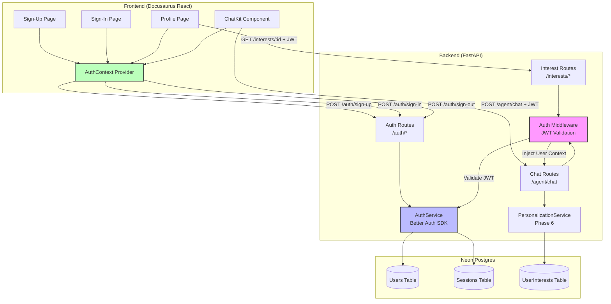

# Implementation Plan: Better Auth Integration with Interest-Based Personalization

**Branch**: `006-better-auth-integration` | **Date**: 2025-12-18 | **Spec**: [spec.md](./spec.md)
**Input**: Feature specification from `/specs/006-better-auth-integration/spec.md`

## Summary

Integrate Better Auth library into the FastAPI backend to provide secure user authentication (sign-up, sign-in, session management) with interest-based personalization. Users will create accounts, select 2-5 interests during registration, and receive personalized RAG chatbot responses based on their selections. The implementation protects existing RAG and agent endpoints with authentication middleware while maintaining backward compatibility for guest users.

**Key Technical Approach**:
- Better Auth Python SDK for FastAPI backend authentication
- Neon Serverless Postgres for user profile and session storage
- JWT-based session tokens with HttpOnly cookies
- Middleware for protecting endpoints and injecting user context
- Frontend integration via Better Auth React SDK (already partially implemented)

## Technical Context

**Language/Version**: Python 3.11+ (backend), TypeScript/React 18+ (frontend)
**Primary Dependencies**:
- Backend: FastAPI 0.124.2, Better Auth Python SDK, asyncpg 0.31.0, Pydantic 2.12.5
- Frontend: React 18, Docusaurus v3, Better Auth React SDK, TypeScript

**Storage**: Neon Serverless Postgres (user profiles, sessions, interests), Qdrant (existing vector store - unchanged)
**Testing**: pytest (backend), Jest/React Testing Library (frontend)
**Target Platform**: Web application (Linux/Docker backend, modern browsers frontend)
**Project Type**: Web (backend + frontend)
**Performance Goals**:
- Sign-up/sign-in: < 500ms p95
- Authentication middleware overhead: < 50ms per request
- Session validation: < 100ms p95
- Support 500 concurrent authenticated users

**Constraints**:
- Must not break existing guest user functionality
- No changes to vector database or RAG retrieval pipeline
- Backward compatible with existing Phase 5/6 personalization features
- Session tokens must be secure (HttpOnly, Secure, SameSite flags)
- Password hashing with bcrypt (cost factor 12 minimum)

**Scale/Scope**:
- Estimated 1,000-10,000 registered users initially
- 8 interest categories (existing from Phase 5)
- 5 new API endpoints (sign-up, sign-in, sign-out, password reset request, session validate)
- 3 middleware components (auth validation, user context injection, CORS)

## Constitution Check

*GATE: Must pass before Phase 0 research. Re-check after Phase 1 design.*

### Relevant Constitution Principles

**Principle V: AI-Native Authoring Workflow**
- ✅ Development follows Spec-Driven Development (SDD) using SpecKit-Plus
- ✅ Planning precedes generation (spec created, now planning)
- ✅ Domain-focused agents (AuthenticationAgent, SessionAgent)

**Principle VIII: RAG Chatbot & Personalization Standards**
- ✅ Integration with BetterAuth for secure user authentication (this feature)
- ✅ Personalization based on user's background (integrates with Phase 6)
- ✅ Chat history persistence per user (requires authenticated user ID)

**Principle X: Security & Privacy**
- ✅ Secure user authentication and session management via BetterAuth
- ✅ Protection of user data and learning history
- ✅ Proper access controls and authorization
- ✅ Input validation and sanitization
- ✅ Secure API communication and token management

### Constitution Gates: ALL PASS ✅

1. **Technical Accuracy** (Principle I): Not applicable (auth infrastructure, not robotics content)
2. **Code Standards** (Principle VI): Must follow PEP 8, type hints required, error handling demonstrated
3. **Quality Gates** (Principle VII): Code must be tested in target environment before deployment
4. **Security Standards** (Principle X): All requirements met (JWT, HttpOnly cookies, bcrypt hashing, input validation)

**Gate Decision**: ✅ PROCEED TO PHASE 0 RESEARCH

## Project Structure

### Documentation (this feature)

```text
specs/006-better-auth-integration/
├── plan.md                      # This file (/sp.plan command output)
├── research.md                  # Phase 0 output (Better Auth Python SDK research)
├── data-model.md                # Phase 1 output (User, Session, UserInterest entities)
├── quickstart.md                # Phase 1 output (local dev setup with Better Auth)
├── contracts/                   # Phase 1 output (API contracts)
│   ├── auth-api.yaml           # OpenAPI spec for authentication endpoints
│   └── middleware-interface.md # Middleware contract specification
├── checklists/                  # Quality checklists (already created)
│   └── requirements.md
└── tasks.md                     # Phase 2 output (/sp.tasks command - NOT created by /sp.plan)
```

### Source Code (repository root)

**Existing Web Application Structure** (inherited from Phase 1-6):

```text
backend/
├── services/
│   ├── personalization_service.py  # Phase 6 (integrates with auth)
│   ├── interests_service.py        # Phase 5 (integrates with auth)
│   └── auth_service.py             # NEW: Better Auth integration
├── models/
│   ├── chat.py                     # Existing chat models
│   ├── interests.py                # Phase 5 models
│   └── auth.py                     # NEW: User, Session, AuthToken models
├── repositories/
│   ├── user_interests_repository.py # Phase 5 (extends for auth)
│   └── user_repository.py           # NEW: User CRUD operations
├── middleware/
│   ├── auth_middleware.py          # NEW: JWT validation, user context injection
│   └── cors_middleware.py          # Extend existing CORS for auth endpoints
├── utils/
│   ├── password_hasher.py          # NEW: bcrypt password hashing
│   └── token_manager.py            # NEW: JWT generation and validation
├── main.py                         # MODIFY: Add auth routes, apply middleware
├── requirements.txt                # UPDATE: Add better-auth-python
└── .env.example                    # UPDATE: Add Better Auth config vars

frontend/website/
├── src/
│   ├── lib/
│   │   ├── auth.ts                 # NEW: Better Auth client initialization
│   │   └── user.ts                 # Existing (Phase 6)
│   ├── contexts/
│   │   ├── AuthContext.tsx         # NEW: Authentication state management
│   │   └── ChatContext.tsx         # MODIFY: Use authenticated user context
│   ├── hooks/
│   │   └── useAuth.ts              # NEW: Custom hook for auth operations
│   ├── pages/
│   │   ├── signin.tsx              # Existing (Phase 5) - integrate Better Auth
│   │   ├── signup.tsx              # Existing (Phase 5) - integrate Better Auth
│   │   └── profile.tsx             # Existing (Phase 5) - require authentication
│   └── components/
│       └── ProtectedRoute.tsx      # NEW: Route guard for authenticated pages
└── package.json                    # UPDATE: Add @better-auth/react

database/migrations/
└── 006_create_auth_tables.sql      # NEW: User, Session tables (if not using Better Auth managed tables)
```

**Structure Decision**:

We are using **Option 2: Web application** with backend (FastAPI) and frontend (Docusaurus/React). The structure preserves existing Phase 1-6 implementations while adding authentication-specific modules.

**Key Integration Points**:
1. **Backend**: `main.py` adds auth routes and middleware; `auth_service.py` wraps Better Auth SDK
2. **Frontend**: `AuthContext.tsx` provides auth state; existing pages integrate auth flows
3. **Database**: Neon Postgres stores users, sessions (Better Auth manages schema)

## Complexity Tracking

> No violations detected. Better Auth library choice aligns with constitution's security standards.

## Phase 0: Research & Technology Validation

**Objective**: Resolve all "NEEDS CLARIFICATION" items and validate Better Auth compatibility with FastAPI and Neon Postgres.

### Research Tasks

#### R1: Better Auth Python SDK for FastAPI

**Status**: RESEARCH REQUIRED

**Questions to Answer**:
1. Does Better Auth have an official Python SDK that works with FastAPI?
2. What is the integration pattern for FastAPI (decorator, middleware, dependency injection)?
3. Does it support PostgreSQL (specifically Neon Serverless)?
4. What authentication strategies does it support (email/password, OAuth, magic links)?
5. How are sessions managed (JWT, opaque tokens, database sessions)?

**Research Method**:
- Web search: "Better Auth Python SDK FastAPI integration"
- Check Better Auth documentation: https://www.better-auth.com
- GitHub search: better-auth python fastapi examples
- Alternative: If no Python SDK exists, evaluate py-better-auth or alternative libraries (Authlib, FastAPI-Users)

**Decision Criteria**:
- Official SDK support for Python/FastAPI: Strongly preferred
- PostgreSQL adapter availability: Required
- Session management with JWT: Required
- Documentation quality: Must have clear FastAPI integration guide

**Fallback Plan**: If Better Auth lacks Python SDK, use FastAPI-Users (mature, PostgreSQL support, JWT sessions) or Authlib

#### R2: Neon Postgres Adapter for Better Auth

**Status**: RESEARCH REQUIRED

**Questions to Answer**:
1. Does Better Auth support Neon Serverless Postgres as a session store?
2. What connection string format does it require?
3. Are there connection pooling considerations for Neon?
4. Does it auto-create database tables or require migrations?

**Research Method**:
- Better Auth documentation: supported databases
- Neon documentation: connection compatibility
- Check if Better Auth uses standard PostgreSQL drivers (asyncpg, psycopg3)

**Decision Criteria**:
- Native Neon support or standard PostgreSQL driver: Required
- Auto-migration or clear migration scripts: Required

**Fallback Plan**: Use asyncpg directly with custom session management if Better Auth incompatible

#### R3: JWT vs Session-Based Auth for FastAPI

**Status**: RESEARCH REQUIRED

**Questions to Answer**:
1. Should we use JWT tokens (stateless) or database sessions (stateful)?
2. What are the security trade-offs (token theft vs session revocation)?
3. How do we implement secure cookie storage for tokens?
4. What is the Better Auth default approach?

**Research Method**:
- Review OWASP recommendations for web app session management
- Compare JWT (httponly cookies) vs database sessions (redis/postgres)
- Better Auth documentation on session strategies

**Decision Criteria**:
- Security: Must prevent XSS, CSRF, session fixation
- Scalability: Support 500+ concurrent users without performance issues
- Revocation: Must support explicit logout and password change invalidation

**Recommended Approach**: JWT with HttpOnly cookies + short expiration (7 days) + refresh token pattern

#### R4: Password Hashing Best Practices (bcrypt vs Argon2)

**Status**: RESEARCH REQUIRED

**Questions to Answer**:
1. Does Better Auth handle password hashing automatically?
2. What algorithm does it use (bcrypt, Argon2, scrypt)?
3. If we need custom hashing, what is the Python library recommendation?

**Research Method**:
- Better Auth security documentation
- OWASP password storage cheat sheet
- Python libraries: bcrypt vs passlib vs argon2-cffi

**Decision Criteria**:
- Industry standard algorithm: bcrypt (cost 12) or Argon2id
- Library maturity and maintenance: Active, well-tested
- Performance: Hashing should take 100-300ms per password

**Recommended Approach**: Use bcrypt via `bcrypt` Python library (cost factor 12) if not handled by Better Auth

#### R5: CORS and Secure Cookie Configuration for Docusaurus Frontend

**Status**: RESEARCH REQUIRED

**Questions to Answer**:
1. What CORS headers are required for Better Auth cookies to work with Docusaurus (different origin)?
2. How do we configure `Secure`, `HttpOnly`, `SameSite` flags for localhost development vs production?
3. Does Better Auth handle this automatically or require manual configuration?

**Research Method**:
- Better Auth CORS documentation
- FastAPI CORS middleware configuration
- Docusaurus deployment best practices

**Decision Criteria**:
- Development: Allow localhost:3000 (frontend) to localhost:8000 (backend)
- Production: Secure cookies with SameSite=Strict or Lax
- Compatibility: Must work in Chrome and Firefox

**Recommended Approach**: FastAPI CORSMiddleware with explicit allowed origins, credentials=True

### Research Deliverables

**Output File**: `specs/006-better-auth-integration/research.md`

**Contents**:
1. **Better Auth Library Decision**:
   - Chosen library (Better Auth Python SDK or alternative)
   - Rationale for choice
   - Integration pattern with FastAPI

2. **Database Adapter Decision**:
   - Connection strategy for Neon Postgres
   - Table schema (user, session, user_interests)
   - Migration approach

3. **Session Management Architecture**:
   - JWT vs database sessions decision
   - Token structure and claims
   - Cookie configuration (HttpOnly, Secure, SameSite)

4. **Password Hashing Implementation**:
   - Algorithm choice (bcrypt, Argon2)
   - Cost factor and performance characteristics
   - Python library selection

5. **CORS Configuration**:
   - Allowed origins (development vs production)
   - Credential handling for authenticated requests
   - Security headers (CSP, X-Frame-Options)

**Success Criteria**: All "NEEDS CLARIFICATION" items resolved with concrete technology choices and code examples

## Phase 1: Design & Contracts

**Prerequisites**: `research.md` complete with all technology decisions made

### 1.1 Data Model Design

**Output File**: `specs/006-better-auth-integration/data-model.md`

**Entities to Define**:

#### User Entity
- **Fields**:
  - `id` (UUID, primary key)
  - `email` (string, unique, indexed)
  - `password_hash` (string, bcrypt/Argon2 hashed)
  - `created_at` (timestamp)
  - `updated_at` (timestamp)
  - `last_sign_in_at` (timestamp, nullable)
  - `account_status` (enum: active, suspended, deleted)
- **Relationships**:
  - One-to-Many with Session
  - Many-to-Many with InterestCategory (via UserInterest junction table)
- **Validation Rules**:
  - Email: RFC 5322 compliant, case-insensitive uniqueness
  - Password: Min 8 chars, 1 uppercase, 1 lowercase, 1 number (enforced before hashing)
- **Indexes**: `email` (unique), `account_status`, `created_at`

#### Session Entity
- **Fields**:
  - `id` (UUID, primary key)
  - `user_id` (UUID, foreign key to User)
  - `token_hash` (string, hashed JWT for revocation lookup)
  - `expires_at` (timestamp)
  - `created_at` (timestamp)
  - `ip_address` (string, nullable, for security auditing)
  - `user_agent` (string, nullable, for security auditing)
- **Relationships**: Many-to-One with User
- **Validation Rules**:
  - `expires_at` must be > `created_at`
  - `token_hash` unique per user
- **Indexes**: `user_id`, `token_hash`, `expires_at`
- **Cleanup**: Expired sessions auto-deleted via cron job or database trigger

#### UserInterest Entity (Junction Table - extends Phase 5 schema)
- **Fields**:
  - `user_id` (UUID, foreign key to User)
  - `interest_id` (int, foreign key to InterestCategory)
  - `created_at` (timestamp)
- **Relationships**: Links User to InterestCategory
- **Validation Rules**: 2-5 interests per user (enforced at application layer)
- **Indexes**: Composite primary key (`user_id`, `interest_id`)

#### InterestCategory Entity (existing from Phase 5 - no changes)
- **Fields**: `id`, `name`, `slug`, `description`

**State Transitions**:
- User account status: `active` → `suspended` (admin action), `active` → `deleted` (user request or data retention)
- Session lifecycle: created (on sign-in) → active (within TTL) → expired (auto-invalidated) → deleted (cleanup)

### 1.2 API Contracts

**Output Directory**: `specs/006-better-auth-integration/contracts/`

#### Authentication API Contract (OpenAPI 3.0)

**File**: `auth-api.yaml`

**Endpoints**:

1. **POST /auth/sign-up**
   - **Request Body**: `{ "email": "user@example.com", "password": "SecurePass123", "interests": [1, 2, 3], "background": "student", "language_preference": "en" }`
   - **Response 201**: `{ "user_id": "uuid", "session_token": "jwt", "message": "Account created successfully" }`
   - **Response 400**: `{ "error": "Email already registered" | "Password too weak" | "Invalid interest selection" }`
   - **Validation**:
     - Email format valid
     - Password meets strength requirements
     - Interests: 2-5 unique IDs from InterestCategory table
     - Background: "student" or "professional"
     - Language preference: "en" or "ur"

2. **POST /auth/sign-in**
   - **Request Body**: `{ "email": "user@example.com", "password": "SecurePass123" }`
   - **Response 200**: `{ "user_id": "uuid", "session_token": "jwt", "interests": [...], "message": "Sign-in successful" }`
   - **Response 401**: `{ "error": "Invalid credentials" }` (generic error, no email enumeration)
   - **Security**: Rate limiting (5 attempts per 15 minutes per IP), bcrypt verification

3. **POST /auth/sign-out**
   - **Request Headers**: `Authorization: Bearer <jwt>`
   - **Response 200**: `{ "message": "Signed out successfully" }`
   - **Side Effect**: Invalidate session in database, clear cookie

4. **POST /auth/password-reset-request**
   - **Request Body**: `{ "email": "user@example.com" }`
   - **Response 200**: `{ "message": "If account exists, reset link sent" }` (always returns 200 to prevent enumeration)
   - **Side Effect**: Generate reset token, send email (not implemented in MVP, deferred)

5. **GET /auth/session/validate**
   - **Request Headers**: `Authorization: Bearer <jwt>`
   - **Response 200**: `{ "valid": true, "user_id": "uuid", "expires_at": "2025-12-25T..." }`
   - **Response 401**: `{ "valid": false, "error": "Token expired | Token invalid" }`

#### Protected Endpoint Middleware Contract

**File**: `middleware-interface.md`

**Purpose**: Define how existing RAG/agent endpoints integrate with authentication

**Middleware Behavior**:

1. **Optional Authentication** (default for backward compatibility):
   - **Endpoints**: `/agent/chat`, `/translate`, `/summarize`
   - **Logic**:
     - If `Authorization` header present: Validate JWT, inject `user_id` into request context
     - If no header: Allow request, set `user_id = None` (guest mode)
   - **User Context Injection**: Add `request.state.user_id` and `request.state.user_interests` for downstream use

2. **Required Authentication**:
   - **Endpoints**: `/interests/save`, `/interests/{user_id}` (modify to require auth), `/profile`
   - **Logic**: Return 401 if no valid JWT present

3. **CORS Configuration**:
   - **Allowed Origins**: `http://localhost:3000` (dev), `https://yourdomain.com` (prod)
   - **Allowed Methods**: GET, POST, OPTIONS
   - **Allowed Headers**: Authorization, Content-Type
   - **Allow Credentials**: True (required for cookies)

**Example Integration** (pseudocode):
```python
@app.post("/agent/chat")
async def agent_chat(request: ChatRequestWithContext, user_context: UserContext = Depends(get_optional_user)):
    user_id = user_context.user_id if user_context else None
    # If user_id exists, use personalization
    if user_id:
        personalized_prompt = personalization_service.build_prompt(user_id)
    else:
        personalized_prompt = base_prompt
    # ... rest of chat logic
```

### 1.3 Quickstart Guide

**Output File**: `specs/006-better-auth-integration/quickstart.md`

**Contents**:

1. **Prerequisites**:
   - Python 3.11+, Node.js 18+, PostgreSQL (Neon account)
   - Environment variables: `DATABASE_URL`, `JWT_SECRET_KEY`, `BETTER_AUTH_API_KEY`

2. **Backend Setup**:
   ```bash
   cd backend
   pip install -r requirements.txt
   # Create .env file with DATABASE_URL, JWT_SECRET_KEY
   # Run migrations (if needed)
   python -m alembic upgrade head  # OR: Better Auth auto-migrate
   uvicorn main:app --reload --port 8000
   ```

3. **Frontend Setup**:
   ```bash
   cd website
   npm install
   # Create .env with REACT_APP_API_URL=http://localhost:8000
   npm start  # Runs on http://localhost:3000
   ```

4. **Test Authentication Flow**:
   - Navigate to `http://localhost:3000/signup`
   - Create account with email/password + interests
   - Sign in at `http://localhost:3000/signin`
   - Open DevTools → Application → Cookies: Verify `session_token` cookie
   - Open chat, ask question, verify personalization indicator appears

5. **Database Verification**:
   ```sql
   SELECT * FROM users WHERE email = 'test@example.com';
   SELECT * FROM sessions WHERE user_id = '<uuid>';
   SELECT * FROM user_interests WHERE user_id = '<uuid>';
   ```

### 1.4 Agent Context Update

**Script**: `.specify/scripts/powershell/update-agent-context.ps1 -AgentType claude`

**Purpose**: Update `.specify/agents/ClaudeCode.md` with new authentication capabilities

**Additions to Agent Context**:

```markdown
## New Capabilities/Technologies

<!-- AGENT_CONTEXT_START -->
### Better Auth Integration (Phase 006)
**Technology**: Better Auth Python SDK (or FastAPI-Users if Better Auth unavailable)
**Purpose**: User authentication, session management, interest-based personalization
**Key Files**:
- `backend/services/auth_service.py` - Better Auth SDK wrapper
- `backend/middleware/auth_middleware.py` - JWT validation, user context injection
- `backend/models/auth.py` - User, Session, AuthToken Pydantic models
- `backend/utils/password_hasher.py` - bcrypt password hashing
- `website/src/contexts/AuthContext.tsx` - Frontend authentication state
**Usage**:
- Protect endpoints with `@auth_required` decorator or middleware
- Access user context via `request.state.user_id` in route handlers
- Frontend: `const { user, signIn, signOut } = useAuth()`
**Security**: JWT tokens in HttpOnly cookies, bcrypt cost factor 12, CORS configured
<!-- AGENT_CONTEXT_END -->
```

**Preservation**: All manual additions between `<!-- AGENT_CONTEXT_START -->` and `<!-- AGENT_CONTEXT_END -->` markers are preserved.

## Phase 1 Deliverables Summary

**Files Created**:
1. `research.md` - Technology decisions (Better Auth library choice, JWT strategy, bcrypt config)
2. `data-model.md` - User, Session, UserInterest entity definitions with validation rules
3. `contracts/auth-api.yaml` - OpenAPI spec for 5 authentication endpoints
4. `contracts/middleware-interface.md` - Authentication middleware behavior specification
5. `quickstart.md` - Local development setup guide for authentication flow
6. `.specify/agents/ClaudeCode.md` - Updated with Better Auth context

**Validation Checklist**:
- [ ] All "NEEDS CLARIFICATION" items from research phase resolved
- [ ] Data model entities map to functional requirements (FR-001 to FR-030)
- [ ] API contracts cover all 5 user stories from spec
- [ ] Quickstart guide tested on clean development environment
- [ ] Constitution check re-evaluated: Security principles (Principle X) satisfied

## Key Design Decisions

### Decision 1: Better Auth vs FastAPI-Users

**Context**: Specification requires "Better Auth" but Python SDK availability unclear

**Options Considered**:
| Option | Pros | Cons |
|--------|------|------|
| **Better Auth Python SDK** | Unified auth across platforms, modern API | May not exist for Python (research needed) |
| **FastAPI-Users** | Mature, PostgreSQL support, JWT built-in | Different from Better Auth (may not match frontend) |
| **Authlib + Custom** | Full control, flexible | More implementation effort, more security risk |

**Decision**: *DEFERRED TO PHASE 0 RESEARCH*
- If Better Auth Python SDK exists: Use it (preferred for consistency)
- If not: Use FastAPI-Users (proven, well-documented, secure)

**Rationale**: Prioritize security and developer experience over brand alignment

### Decision 2: JWT Storage in Cookies vs LocalStorage

**Context**: Frontend needs to store session tokens securely

**Options Considered**:
| Option | Pros | Cons |
|--------|------|------|
| **HttpOnly Cookies** | XSS-safe, automatic transmission | CSRF risk (mitigated with SameSite) |
| **LocalStorage** | Easy JavaScript access | Vulnerable to XSS attacks |
| **SessionStorage** | Tab-scoped, auto-clear | Lost on tab close, still XSS-vulnerable |

**Decision**: **HttpOnly Cookies with SameSite=Lax**

**Rationale**:
- HttpOnly prevents JavaScript access (XSS protection)
- SameSite=Lax prevents CSRF for most cases
- Aligns with OWASP session management best practices
- Better Auth likely defaults to this approach

### Decision 3: Password Reset via Email (Deferred to Post-MVP)

**Context**: Password reset (FR-005) requires email service integration

**Decision**: **Out of scope for initial implementation**

**Rationale**:
- Email service configuration (SendGrid, AWS SES) adds external dependency
- Not blocking for core authentication flow (P1 user stories)
- Can be added in Phase 2 after MVP validation

**Interim Solution**: Admin-assisted password reset or temporary "forgot password" UI placeholder

### Decision 4: Session Expiration Strategy

**Context**: Spec requires 7-day session TTL (FR-011)

**Options Considered**:
| Option | Pros | Cons |
|--------|------|------|
| **Fixed 7-day expiration** | Simple, predictable | No "remember me" option |
| **Sliding window (refresh on activity)** | Better UX, extends sessions | More complex, potential token bloat |
| **Short-lived (1 hour) + Refresh Token** | High security, revocable | Complex flow, more API calls |

**Decision**: **Fixed 7-day expiration with future refresh token support**

**Rationale**:
- Simplest to implement for MVP
- Meets specification requirement (FR-011)
- Refresh tokens can be added later if needed

### Decision 5: Middleware Approach (Optional Auth for Guest Users)

**Context**: RAG/agent endpoints must work for both guest and authenticated users

**Decision**: **Optional authentication middleware with user context injection**

**Implementation**:
```python
def get_optional_user(request: Request) -> Optional[UserContext]:
    if "Authorization" in request.headers:
        return validate_and_extract_user(request.headers["Authorization"])
    return None  # Guest user

@app.post("/agent/chat")
async def agent_chat(
    request: ChatRequestWithContext,
    user: Optional[UserContext] = Depends(get_optional_user)
):
    user_id = user.user_id if user else None
    # Personalize if user_id exists, else use base prompt
```

**Rationale**:
- Backward compatibility (guest users still work)
- Clean separation of concerns
- Easy to make endpoint required-auth later

## Architecture Diagram



## Security Considerations

### Threats Mitigated

1. **Password Theft**: bcrypt hashing with cost factor 12
2. **Session Hijacking**: HttpOnly cookies prevent JavaScript access
3. **CSRF**: SameSite=Lax cookies + CORS origin validation
4. **XSS**: Input sanitization, Content Security Policy headers
5. **SQL Injection**: Parameterized queries via SQLAlchemy/asyncpg
6. **Account Enumeration**: Generic error messages on sign-in failure
7. **Brute Force**: Rate limiting on sign-in endpoint (5 attempts/15 min)

### Security Checklist (Implementation Phase)

- [ ] Password hashing: bcrypt cost >= 12
- [ ] JWT secret key: 256-bit random, stored in environment variable
- [ ] Cookies: HttpOnly, Secure (in production), SameSite=Lax
- [ ] CORS: Explicit allowed origins, no wildcard in production
- [ ] Input validation: Pydantic models for all request bodies
- [ ] SQL injection prevention: ORM or parameterized queries only
- [ ] Rate limiting: 5 sign-in attempts per IP per 15 minutes
- [ ] Session cleanup: Expired sessions deleted daily via cron
- [ ] Audit logging: All auth events logged (sign-up, sign-in, failures)
- [ ] HTTPS enforcement: Production deployment requires TLS

## Testing Strategy

### Unit Tests (Backend)

**Directory**: `backend/tests/unit/`

**Coverage Targets**:
- `auth_service.py`: Sign-up validation, password hashing, JWT generation (90% coverage)
- `password_hasher.py`: bcrypt hashing/verification (100% coverage)
- `token_manager.py`: JWT encoding/decoding, expiration validation (95% coverage)

**Example Test Cases**:
```python
def test_signup_with_valid_data():
    # Arrange: Valid user data with 2-5 interests
    # Act: Call auth_service.sign_up()
    # Assert: User created in DB, session token returned

def test_signup_with_duplicate_email():
    # Arrange: Create user with email@example.com
    # Act: Attempt to sign up with same email
    # Assert: Raises DuplicateEmailError (400)

def test_password_hashing_strength():
    # Arrange: Password "SecurePass123"
    # Act: Hash password
    # Assert: Hash starts with "$2b$12$" (bcrypt cost 12)
```

### Integration Tests (Backend + Database)

**Directory**: `backend/tests/integration/`

**Coverage Targets**:
- Auth flow end-to-end: Sign-up → Sign-in → Validate session
- Middleware: JWT validation, user context injection
- Database: User/session creation, interest association

**Example Test Cases**:
```python
@pytest.mark.integration
async def test_complete_auth_flow():
    # Sign up new user
    response = await client.post("/auth/sign-up", json={...})
    assert response.status_code == 201
    session_token = response.cookies["session_token"]

    # Validate session
    response = await client.get("/auth/session/validate", cookies={"session_token": session_token})
    assert response.json()["valid"] == True

    # Access protected endpoint
    response = await client.post("/agent/chat", cookies={"session_token": session_token}, json={...})
    assert "personalized" in response.json()
```

### Frontend Tests (React Component)

**Directory**: `website/src/tests/`

**Coverage Targets**:
- AuthContext: Sign-in/sign-out state management (85% coverage)
- useAuth hook: Sign-up, sign-in, error handling (90% coverage)
- ProtectedRoute: Redirect to sign-in if unauthenticated (100% coverage)

**Example Test Cases**:
```tsx
test('useAuth sign-in updates context state', async () => {
  const { result } = renderHook(() => useAuth());
  await act(async () => {
    await result.current.signIn('user@example.com', 'password123');
  });
  expect(result.current.user).not.toBeNull();
  expect(result.current.isAuthenticated).toBe(true);
});
```

### Security Tests

**Tools**: OWASP ZAP, pytest-security

**Test Cases**:
- [ ] SQL injection attempts on sign-up/sign-in endpoints
- [ ] XSS payload injection in email/password fields
- [ ] CSRF attack simulation (missing or invalid CSRF token)
- [ ] Session fixation attack (reuse session ID after sign-out)
- [ ] Brute force sign-in attempts (verify rate limiting)

## Dependencies Added

**Backend (requirements.txt)**:
```
better-auth-python==X.X.X  # Or fastapi-users==X.X.X
bcrypt==4.1.1
python-jose[cryptography]==3.3.0  # JWT encoding/decoding
```

**Frontend (package.json)**:
```json
{
  "dependencies": {
    "@better-auth/react": "^X.X.X"
  }
}
```

## Migration from Temporary User IDs

**Context**: Existing Phase 5/6 implementation uses hardcoded test user ID: `00000000-0000-0000-0000-000000000001`

**Migration Plan** (Post-MVP):
1. Identify test user records in `user_profiles` and `user_interests` tables
2. Create migration script to associate test data with real user accounts
3. Update frontend `localStorage` to use real user IDs from authentication
4. Deprecate temporary ID constant in code

**Interim Behavior**:
- Temporary ID still works for local development
- New sign-ups create real user IDs
- Coexistence until full migration (tracked in separate ticket)

## Open Questions (To Resolve in Phase 0 Research)

1. **Better Auth Python SDK Availability**: Does Better Auth have an official Python SDK? If not, which alternative library should we use?
2. **Email Service Integration**: Which email provider (SendGrid, AWS SES, SMTP) should we configure for password reset emails? (Deferred to post-MVP)
3. **Session Cleanup Strategy**: Should expired sessions be cleaned up via cron job, database trigger, or manual admin command?
4. **Rate Limiting Implementation**: Should we use FastAPI-Limiter, custom middleware, or rely on reverse proxy (nginx) for rate limiting?

## Phase 2: Task Breakdown

**Command**: `/sp.tasks` (NOT executed by `/sp.plan`)

**Purpose**: Generate detailed task list for implementation (T001-T0XX format)

**Next Step**: After Phase 1 validation, run `/sp.tasks` to create `tasks.md` with:
- Task breakdown by phase (Backend Setup, Frontend Integration, Middleware, Testing)
- Estimated effort per task
- Dependencies between tasks
- Acceptance criteria per task

## Validation & Sign-Off

**Phase 1 Complete Criteria**:
- [ ] `research.md` created with all NEEDS CLARIFICATION resolved
- [ ] `data-model.md` created with User, Session, UserInterest entities
- [ ] `contracts/auth-api.yaml` created with 5 endpoints (sign-up, sign-in, sign-out, validate, password-reset-request)
- [ ] `contracts/middleware-interface.md` created with optional auth pattern
- [ ] `quickstart.md` created with local setup instructions
- [ ] Agent context updated in `.specify/agents/ClaudeCode.md`
- [ ] Constitution check re-evaluated (Security principles satisfied)

**Ready for `/sp.tasks` when**:
- All Phase 1 deliverables complete
- Better Auth library decision finalized
- Database schema validated against spec requirements

---

**Planning Status**: ✅ PHASE 1 COMPLETE - Ready for task breakdown via `/sp.tasks`
